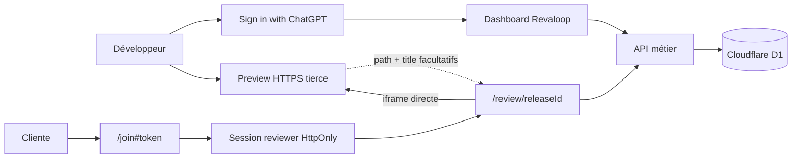
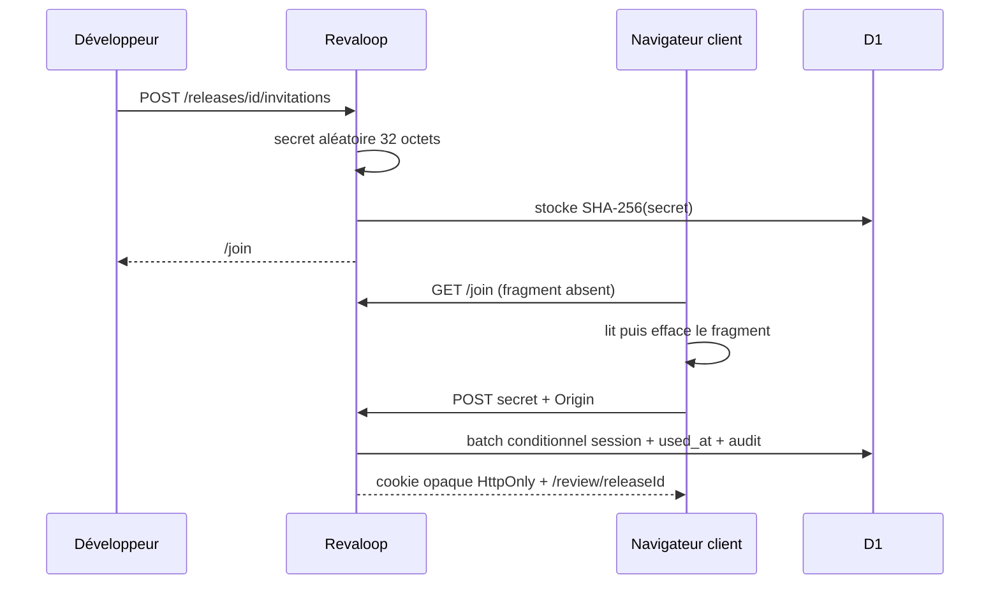
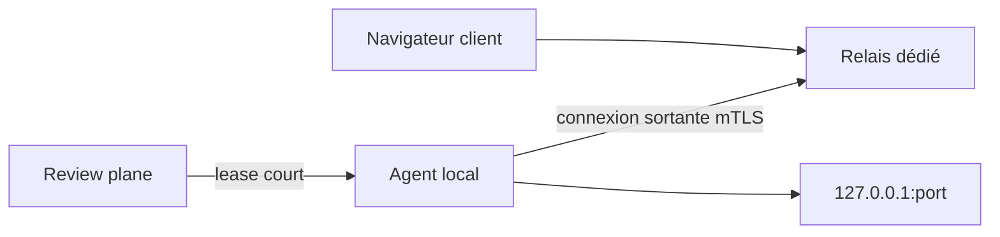

# Architecture de Revaloop

- **Version décrite :** alpha 0.2
- **Dernière mise à jour :** 25 juillet 2026

## Principe directeur

Revaloop sépare deux systèmes :

1. le **review plane**, aujourd’hui implémenté, qui gère identité, projets,
   releases, invitations, retours et décisions ;
2. le futur **data plane**, qui transportera le trafic entre le navigateur
   client et une application locale.

Le Worker web ne doit jamais devenir implicitement un proxy réseau générique.

## Architecture implémentée



La preview est chargée par le navigateur. Revaloop ne reçoit ni son trafic, ni
ses cookies, ni ses champs de formulaire. Cette intégration ne protège pas
l’URL de staging : son authentification, ses comptes et sa base restent gérés
séparément par l’application tierce.

### Runtime

- Next App Router compilé par vinext ;
- Cloudflare Worker dans `worker/index.ts` ;
- routes et composants dans `app/` ;
- logique d’identité dans `app/chatgpt-auth.ts` et `lib/auth.ts` ;
- primitives de sécurité dans `lib/security.ts` ;
- repository D1 dans `db/repository.ts` ;
- schéma Drizzle dans `db/schema.ts` ;
- migrations dans `drizzle/`.

Le plugin de build copie la configuration Sites et les migrations dans
`dist/.openai`.

### Routes

| Route | Frontière |
|---|---|
| `/` | publique |
| `/demo` | publique, données synthétiques |
| `/dashboard` | identité Sites obligatoire |
| `/join` | publique, ne reçoit pas le fragment au premier GET |
| `/review/[releaseId]` | cookie de session lié à la release |
| `/api/projects/**` | développeur + organisation |
| `/api/releases/**` | développeur + projet |
| `/api/reviewer/session` | invitation ou session |
| `/api/review/**` | session reviewer |
| `/api/feedback/**` | développeur |

### Identité développeur

Sur Sites, l’adaptateur lit les headers réservés de Sign in with ChatGPT. Le
build de production n’accorde aucune identité locale. En développement, une
identité de test n’est créée que pour `localhost`, `127.0.0.1` ou `::1`.

La première connexion provisionne un utilisateur et une organisation
personnelle. Les identifiants sont déterministes par e-mail afin qu’un
provisionnement concurrent reste idempotent. Les requêtes de ressource joignent
toujours membre, organisation et projet.

L’inscription SIWC libre est un choix d’alpha. Une instance fermée doit ajouter
une allowlist ou un système d’invitation développeur.

### Invitation et session cliente



Le batch d’échange garantit qu’une invitation n’est jamais consommée sans
session. Le cookie expire au plus tôt entre l’invitation et 24 heures.

Le nom de reviewer est saisi par le développeur lors de la création du lien,
puis porté par l’invitation et la session. Il sert de libellé d’auteur, mais
n’est pas une identité authentifiée. L’interface actuelle ne collecte aucune
adresse e-mail cliente ; l’API et le schéma gardent seulement un champ nullable
pour compatibilité avec un client API personnalisé.

### Écriture d’un retour

L’écriture finale revérifie dans la même transaction :

- session et hash ;
- correspondance invitation/session/release ;
- absence de révocation ;
- expirations ;
- statut actif `in_review` ou `changes_requested`.

Le batch incrémente le compteur, insère le retour avec ce numéro puis ajoute
l’audit. Une approbation concurrente ne peut donc pas clôturer une release avec
un nouveau retour ouvert.

### Décision

L’écriture d’une décision utilise un `INSERT ... SELECT` conditionnel avec
`UPSERT`. Une contrainte unique conserve une seule ligne de décision courante
par release :

- `changes_requested` place la release dans un état non terminal, garde
  `closed_at` à `NULL` et laisse actifs checklist, retours, revalidation et
  invitations ;
- un bilan ultérieur peut remplacer cette demande d’ajustements ;
- `approved` exige dans le SQL qu’aucun retour non résolu n’existe, puis ferme
  définitivement la release ;
- une décision déjà approuvée ne peut plus être remplacée.

Chaque écriture réussie produit un événement d’audit, même si la ligne de
décision courante est remplacée.

### Publication d’une nouvelle release

Une seule release courante est exposée dans l’interface alpha. Le serveur refuse
une nouvelle publication tant qu’une release non expirée est `in_review` ou
`changes_requested`. Le développeur poursuit donc corrections et revalidations
sur la même release jusqu’à son approbation ou son expiration.

Après approbation, une nouvelle release peut être insérée et l’ancienne conserve
son état `approved`. Après expiration, le batch de publication révoque les
invitations et sessions encore présentes, passe l’ancienne release active à
`superseded`, puis insère la nouvelle release et ses consignes. L’historique
navigable viendra dans une version ultérieure.

## Modèle D1

Les quatre tables 0.1 restent temporairement présentes pour une migration
expand/contract. Les parcours réels utilisent :

```text
app_users
organizations
└── organization_members
└── client_projects
    └── review_releases
        ├── review_test_items
        │   └── review_test_completions
        ├── review_invitations
        │   └── reviewer_sessions
        ├── review_feedback
        └── review_decisions
audit_events
rate_limit_buckets
```

Principaux invariants :

- slug unique dans une organisation ;
- version unique dans un projet ;
- hash d’invitation et de session uniques ;
- séquence unique dans une release ;
- une ligne de décision courante par release, remplaçable seulement tant que son
  état est `changes_requested` ;
- une complétion par session et consigne ;
- suppression en cascade depuis le projet ;
- référence de session d’une décision nullable pour permettre la purge.

Les migrations `0001` et `0002` introduisent le modèle sécurisé et la
suppression possible des sessions. Le bootstrap `CREATE IF NOT EXISTS` reste
présent pour les environnements Sites qui démarrent sur une D1 vide ; il devra
disparaître lorsque le déploiement exécutera explicitement les migrations.

## Preview externe

`normalizeExternalPreviewUrl` accepte uniquement :

- HTTPS en production ;
- aucun identifiant dans l’URL ;
- aucune query string ;
- localhost HTTP seulement quand Revaloop lui-même tourne en local.

La CSP autorise `frame-src https:` parce que la fonction du produit consiste à
charger l’origine choisie par le développeur. Une instance fermée peut
resserrer cette règle par allowlist.

Le sandbox iframe autorise scripts, formulaires, popups et same-origin, mais
pas top-navigation ni téléchargement. La politique du portail désactive aussi
caméra, microphone, géolocalisation, paiement et USB. Les cookies tiers,
`SameSite`, les restrictions de confidentialité du navigateur, OAuth/SSO et les
popups peuvent rendre une authentification embarquée inutilisable. Revaloop
affiche toujours un lien vers un nouvel onglet et un retour général pour ces
cas.

L’invitation Revaloop n’est pas un contrôle d’accès de la preview. Un staging
public reste public ; un staging privé doit appliquer sa propre
authentification, compatible avec le navigateur choisi.

### Bridge

`public/revaloop-bridge.js` est facultatif. Il valide l’origine par son attribut
`data-revaloop-origin` et ne transmet que :

```json
{
  "type": "revaloop:context",
  "path": "/chemin-sans-query",
  "title": "Titre de page"
}
```

Le parent vérifie simultanément `event.origin` et `event.source`. Le bridge ne
transmet ni query, ni hash, ni scroll, ni sélecteur DOM, ni contenu. Les pins
sont filtrés par chemin et viewport, mais leurs coordonnées restent des
pourcentages du viewport visible au moment du clic. Même instrumentée, une
annotation n’est donc pas ancrée à un élément et ne suit pas le scroll interne
de l’iframe.

## En-têtes

Le Worker applique notamment :

```text
Content-Security-Policy
X-Content-Type-Options: nosniff
Referrer-Policy: no-referrer
X-Frame-Options: DENY
Cross-Origin-Opener-Policy: same-origin
Cross-Origin-Resource-Policy: same-origin
Permissions-Policy: camera=(), microphone=(), geolocation=(), payment=(), usb=()
```

`/revaloop-bridge.js` est l’unique exception à la politique de ressources :
il reçoit `Cross-Origin-Resource-Policy: cross-origin` pour pouvoir être chargé
par la preview tierce.

Dashboard, join, review et API reçoivent `private, no-store`. Les pages privées
reçoivent aussi `X-Robots-Tag`.

## Rétention

Au démarrage d’un isolate, une maintenance bornée supprime :

- buckets de rate limit expirés ;
- sessions et invitations opérationnelles anciennes non retenues par une
  décision ;
- audits de plus de 365 jours.

Le projet, ses retours et ses décisions restent jusqu’à suppression explicite.
Voir [DATA_LIFECYCLE.md](DATA_LIFECYCLE.md).

## Futur data plane



Contraintes décidées :

- connexion initiée depuis le poste du développeur ;
- cible loopback explicite ;
- lease court lié au projet et à la release ;
- agent et relais authentifiés mutuellement ;
- HTTP et WebSocket ;
- aucun endpoint de proxy générique dans le Worker ;
- aucun corps, cookie ou header d’autorisation dans les logs.

### TLS

Le mode managé termine TLS au relais et permet les contrôles HTTP, mais
l’opérateur peut lire le trafic. Le mode passthrough futur rendrait le contenu
opaque au relais, avec une gestion plus complexe des certificats et sans
injection de bridge. Voir [ADR-0003](adr/0003-tls-termination-modes.md).

## Décisions associées

- [ADR-0001 — Construire le review plane avant le tunnel](adr/0001-review-plane-first.md)
- [ADR-0002 — Échanger une invitation opaque contre une session](adr/0002-reviewer-authentication.md)
- [ADR-0003 — Distinguer terminaison TLS et passthrough](adr/0003-tls-termination-modes.md)

Toute évolution d’identité, d’autorisation, de stockage, d’origine ou de
transport doit mettre à jour ce document et le modèle de menace.
