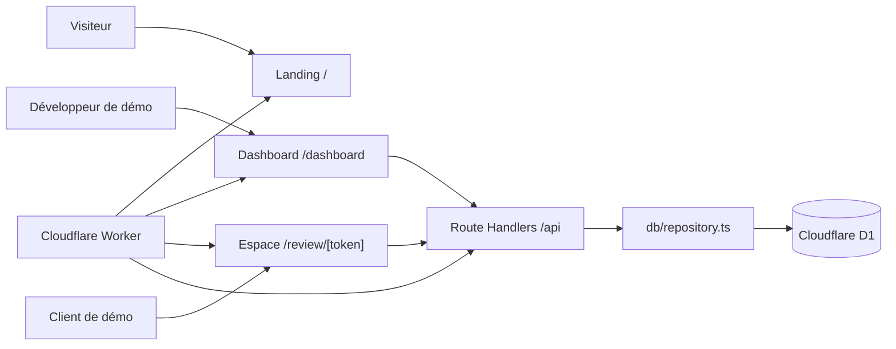
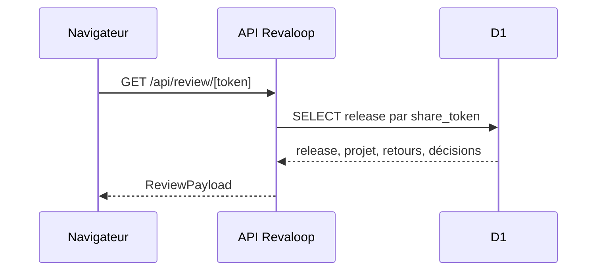
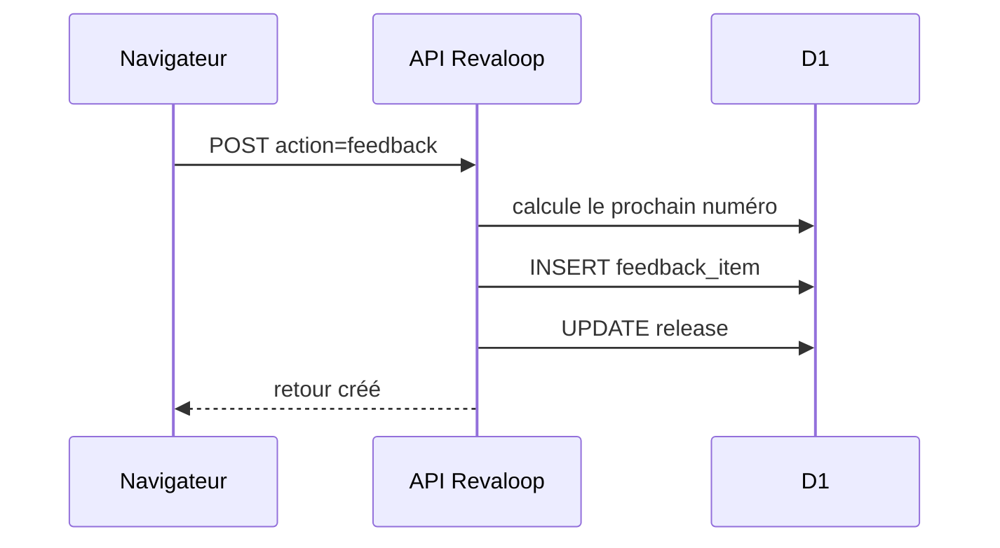
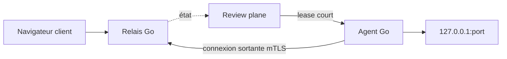

# Architecture de Revaloop

- **Statut du document :** description de l’existant et cible évolutive
- **Dernière vérification :** 24 juillet 2026
- **Portée :** prototype web, plan de revue et futur transport réseau

## Principe directeur

Revaloop est composé de deux plans qui ne doivent pas être confondus :

- le **review plane** organise projets, releases, consignes, retours et
  décisions ;
- le futur **data plane** transportera les requêtes entre un navigateur distant
  et une application locale.

Le dépôt actuel implémente uniquement une démonstration du review plane. Il
n’expose aucun `localhost`.

## Vocabulaire

- **Projet** : espace logique regroupant les versions d’un même produit.
- **Release** : version présentée au client. Dans le prototype, une seule
  release fictive existe.
- **Retour** : observation liée à une release, un viewport et éventuellement
  une position relative.
- **Décision** : approbation ou demande de modifications sur une release.
- **Espace client** : interface guidée sans compte visible.
- **Cible de preview** : contenu que la personne teste. L’application de
  restaurant actuelle est une simulation interne, pas une cible externe.
- **Agent** : futur processus local ouvrant une connexion sortante.
- **Relais** : futur service routant le trafic public vers un agent.

## Architecture implémentée



### Runtime

Le projet est un monolithe vinext/React exécuté par un Cloudflare Worker :

- pages et composants React dans `app/` ;
- Route Handlers dans `app/api/` ;
- données métier et fixtures dans `lib/revaloop.ts` ;
- accès D1 dans `db/repository.ts` ;
- schéma Drizzle dans `db/schema.ts` ;
- en-têtes HTTP globaux dans `worker/index.ts`.

Le Worker sert également l’optimisation d’images vinext. Il ne contient aucune
fonction de relais réseau.

### Interfaces visibles

| Route | Statut | Responsabilité |
|---|---|---|
| `/` | implémentée | landing et accès aux deux démonstrations |
| `/dashboard` | prototype | lecture et traitement des retours |
| `/review/[token]` | prototype | consignes, simulation, annotation et décision |

Le dashboard est initialisé avec les fixtures puis tente de charger D1 par
`GET /api/workspace`. L’espace client suit le même mécanisme avec
`GET /api/review/[token]`. Le token de démonstration est vérifié avant le rendu ;
un accès inconnu ou expiré affiche un écran neutre sans donnée projet.

### API actuelle

| Route | Entrée | Sortie ou effet |
|---|---|---|
| `GET /api/workspace` | aucune | payload Maison Matisse complet |
| `GET /api/review/[token]` | token en chemin | payload associé à la release |
| `POST /api/review/[token]` | action `feedback` | crée un retour et passe la release en changements demandés |
| `POST /api/review/[token]` | action `decision` | crée une décision et change l’état de la release |
| `PATCH /api/feedback/[id]` | nouvel état + token de release | applique une transition autorisée au retour associé |

Ces routes valident quelques listes fermées et longueurs. Elles ne vérifient
pas encore une identité, une révocation, l’origine ou un quota. Elles vérifient
cependant l’expiration, l’association du retour à la release et les transitions
de statut permises.

### Données D1

Le binding actif se nomme `DB`. Quatre tables existent :

```text
projects
  └── releases
        ├── feedback_items
        └── decisions
```

Le repository exécute au runtime un bootstrap `CREATE TABLE IF NOT EXISTS` et
injecte les fixtures Maison Matisse avec `INSERT OR IGNORE`. Une migration
Drizzle correspondant au même schéma est versionnée.

Points importants :

- le champ `share_token` est unique mais stocké en clair ;
- `expires_at` est appliqué à la lecture et aux mutations ;
- la release contient un `commit_sha` déclaratif, sans vérification Git ;
- aucun utilisateur, membre, lien d’invitation, session ou événement d’audit
  n’existe ;
- le binding R2 est désactivé et aucune capture n’est stockée.

### Surface de démonstration

L’espace client affiche une page de restaurant codée dans le composant React.
Les changements de viewport ne démarrent pas un navigateur distant et les
coordonnées de marqueur se rapportent à cette surface simulée.

Le prototype :

- ne charge pas d’iframe ;
- ne suit pas la navigation d’une application tierce ;
- ne capture pas un écran ;
- ne proxifie aucune requête applicative ;
- ne voit aucun trafic provenant d’un serveur local.

### En-têtes HTTP

Le Worker ajoute actuellement :

```text
X-Content-Type-Options: nosniff
Referrer-Policy: no-referrer
X-Frame-Options: DENY
Permissions-Policy: camera=(), microphone=(), geolocation=(), payment=(), usb=()
Content-Security-Policy: ...
```

La CSP limite les sources à Revaloop et interdit `frame-ancestors`. Elle
autorise encore les styles et scripts inline requis par le prototype. Toute
évolution vers une preview externe demandera une politique plus granulaire.

## Flux actuels

### Lecture de l’espace



### Création d’un retour



Le calcul du numéro puis l’insertion ne sont pas actuellement atomiques. Deux
écritures concurrentes peuvent donc recevoir le même numéro de séquence.

## Cible du review plane

Le modèle cible conserve le monolithe pour le produit web, mais introduit des
adaptateurs explicites :

```text
DeveloperIdentityProvider
ReviewSessionProvider
ProjectRepository
ReleaseRepository
ReviewRepository
ObjectStore
PreviewTargetDriver
```

Les valeurs prévues pour `PreviewTargetDriver` sont :

- `external` : URL HTTPS fournie par le développeur ;
- `snapshot` : capture figée et stockée ;
- `tunnel` : future session locale via agent et relais ;
- `hosted` : future preview construite dans un runner isolé.

Le code métier ne devra pas dépendre directement de D1, R2 ou des headers
propres à un hébergeur. Cette séparation permettra PostgreSQL, S3/MinIO et
OIDC lors de l’auto-hébergement.

### Release et immuabilité

Une release publiée devra devenir immuable :

- numéro, titre, changelog et référence source figés ;
- nouvelle release pour tout changement ;
- retours et décision conservés sur la version réellement testée ;
- cible externe marquée **mutable** tant que son contenu ne peut pas être
  vérifié ;
- capture stockée avec empreinte de contenu.

Une URL externe n’est jamais une preuve d’immuabilité.

## Cible du data plane

Le futur transport sera un composant séparé du Worker :



Contraintes décidées :

- connexion initiée depuis le poste du développeur ;
- cible limitée à `127.0.0.1:<port>` par défaut ;
- lease court lié à un projet et une release ;
- authentification mutuelle de l’agent et du relais ;
- prise en charge HTTP et WebSocket ;
- état `online/offline` séparé des données de revue ;
- commentaires conservés lorsque la session locale s’arrête ;
- aucun endpoint de proxy générique dans le Worker vinext.

Ces éléments sont une cible, pas une implémentation.

## TLS

Deux modes sont étudiés :

### Managed review

TLS termine au relais. Le relais peut appliquer le contrôle d’accès HTTP et
éventuellement intégrer un bridge de review, mais l’opérateur peut lire le
trafic applicatif.

```text
navigateur ──TLS──> relais ──mTLS──> agent ──HTTP──> localhost
```

Ce mode ne doit jamais être décrit comme chiffré de bout en bout.

### Confidential passthrough

Le relais route des octets TLS opaques et la terminaison a lieu dans l’agent.
Ce mode protège le contenu contre le relais, mais empêche celui-ci d’appliquer
une authentification HTTP, un WAF ou une injection de widget.

La gestion des certificats navigateur, des domaines et de la révocation reste
à résoudre. Le mode est classé **recherche**, sans engagement de livraison.

Voir [ADR-0003](adr/0003-tls-termination-modes.md).

## Isolation

Le prototype actuel utilise une base D1 et un jeu de données uniques. Il n’a
aucune isolation multi-tenant.

La cible distingue :

1. **autorisation logique** : chaque requête joint identité, projet et
   ressource ;
2. **origine web** : les contenus non fiables ne partagent pas les secrets du
   portail ;
3. **data plane** : identifiants de tunnel non réutilisables, quotas et
   routage vérifié ;
4. **preview hébergée** : runner rootless séparé, réseau, base et secrets
   isolés par release.

Les niveaux 3 et 4 ne doivent pas être annoncés avant des tests d’évasion et
d’accès croisé.

## Décisions associées

- [ADR-0001 — Construire le review plane avant le tunnel](adr/0001-review-plane-first.md)
- [ADR-0002 — Échanger une invitation opaque contre une session](adr/0002-reviewer-authentication.md)
- [ADR-0003 — Distinguer terminaison TLS et passthrough](adr/0003-tls-termination-modes.md)

## Règle de mise à jour

Toute pull request qui :

- ajoute un composant ;
- change un flux de données ;
- déplace une terminaison TLS ;
- modifie une frontière d’identité, d’autorisation ou d’isolation ;
- introduit un stockage ou un sous-traitant ;

doit mettre à jour ce document et
[THREAT_MODEL.md](THREAT_MODEL.md) dans la même pull request.
