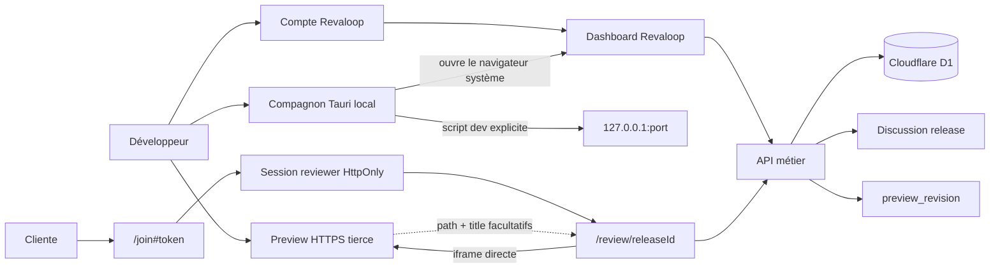
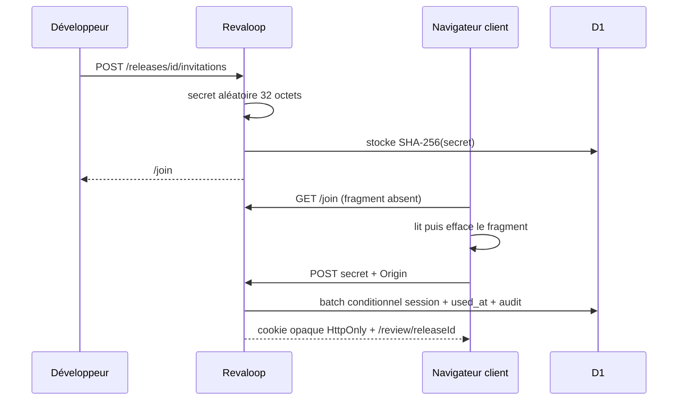
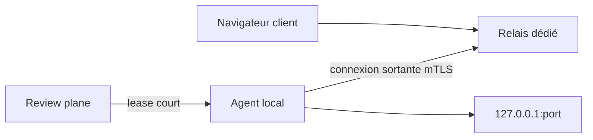

# Architecture de Revaloop

- **Version décrite :** alpha 0.3 en cours
- **Dernière mise à jour :** 25 juillet 2026

## Principe directeur

Revaloop sépare trois frontières :

1. le **review plane**, aujourd’hui implémenté, qui gère identité, projets,
   releases, invitations, retours, discussion, révisions déclarées et
   décisions ;
2. le **compagnon desktop local**, aujourd’hui implémenté en alpha, qui prépare
   et surveille explicitement le projet sans charger le site dans sa WebView ;
3. le futur **data plane**, qui transportera le trafic entre le navigateur
   client et une application locale.

Le Worker web ne doit jamais devenir implicitement un proxy réseau générique.

## Architecture implémentée



La preview est chargée par le navigateur. Revaloop ne reçoit ni son trafic, ni
ses cookies, ni ses champs de formulaire. Cette intégration ne protège pas
l’URL de staging : son authentification, ses comptes et sa base restent gérés
séparément par l’application tierce.

### Runtime

- Next App Router compilé par vinext ;
- Cloudflare Worker dans `worker/index.ts` ;
- routes et composants dans `app/` ;
- logique d’identité dans `lib/developer-auth.ts` et `lib/auth.ts` ;
- primitives de sécurité dans `lib/security.ts` ;
- repository D1 dans `db/repository.ts` ;
- schéma Drizzle dans `db/schema.ts` ;
- migrations dans `drizzle/`.

Le plugin de build copie la configuration Sites et les migrations dans
`dist/.openai`.

### Compagnon desktop

Le dossier `desktop/` contient une SPA React/Vite locale et un backend Tauri 2
en Rust. Ce n’est pas une copie du Worker et aucune origine distante n’est
chargée dans sa fenêtre.

Les seules commandes IPC exposées sont sémantiques :

| Commande | Limite |
|---|---|
| `inspect_project` | dossier choisi, `package.json` régulier et inférieur à 1 Mio |
| `start_dev_server` | relecture du manifeste, script inchangé, exécution fixe de `npm --ignore-scripts run dev` |
| `stop_dev_server` | processus et groupe créés par l’application uniquement |
| `probe_preview` | HTTP(S) vers une adresse loopback numérique normalisée |
| `load_settings` / `save_settings` | chemin et URL non secrètes dans le dossier de configuration de l’app |
| `open_external` | preview loopback ou routes `login`/`dashboard` d’une origine HTTPS validée |

Le renderer ne dispose ni d’un shell générique, ni d’un client HTTP natif, ni
d’un accès filesystem général. Ses permissions sont limitées à l’écoute et au
retrait des événements émis par Rust, ainsi qu’au sélecteur natif de dossier.
La CSP locale interdit frames, objets, workers et formulaires ; les assets sont
embarqués.

Le script du projet reste du code arbitraire appartenant au développeur. Il
n’est jamais lancé à la sélection : le chemin, le contenu exact du script et
une confirmation sont affichés avant l’action. Les hooks npm `predev` et
`postdev` sont désactivés afin qu’aucun script adjacent ne soit exécuté
implicitement. Les logs sont gardés dans la
mémoire du renderer, bornés, non persistés et les lignes contenant des marqueurs
de credential sont masquées. `HOST=127.0.0.1` est fourni au processus, mais un
script reste libre de l’ignorer ; seule la cible manipulée par Revaloop est
strictement bornée au loopback.

Le bouton vers l’espace en ligne ouvre le navigateur système. Les cookies
`HttpOnly` et `SameSite=Strict` y restent ; ils ne sont ni copiés ni lus par
Tauri.

Une future intégration API suivra un canal d’appareil séparé : navigateur
système, Authorization Code avec PKCE S256 et callback loopback exact, tokens
opaques hachés et révocables, access token court en mémoire Rust et refresh
rotatif dans le coffre OS. Les routes web conserveront leur vérification
d’origine et ne recevront pas de CORS permissif.

### Routes

| Route | Frontière |
|---|---|
| `/` | publique |
| `/demo` | publique, données synthétiques |
| `/login` | publique, ouvre une session développeur |
| `/register` | publique tant que le bootstrap est ouvert |
| `/logout` | session développeur |
| `/dashboard` | session développeur Revaloop obligatoire |
| `/join` | publique, ne reçoit pas le fragment au premier GET |
| `/review/[releaseId]` | cookie de session lié à la release |
| `/api/auth/register` | bootstrap ou inscription explicitement ouverte |
| `/api/auth/login` | tentative bornée, même origine |
| `/api/auth/logout` | session développeur, même origine |
| `/api/projects/**` | développeur + organisation |
| `/api/releases/**` | développeur + projet, dont messages et révision |
| `/api/reviewer/session` | invitation ou session |
| `/api/review/**` | session reviewer, dont `{ kind: "message" }` |
| `/api/feedback/**` | développeur |

### Identité développeur

Revaloop gère directement le compte développeur. Le mot de passe, entre 12 et
128 caractères, est dérivé dans Web Crypto avec PBKDF2-SHA-256, un sel
aléatoire de 16 octets et 600 000 itérations. D1 conserve le dérivé, le sel et
le coût, jamais le mot de passe.

Une connexion valide émet un token opaque aléatoire. Seul son SHA-256 est
stocké dans `developer_sessions`. En production, le token brut est porté par le
cookie `__Host-revaloop_developer`, `Secure`, `HttpOnly`, `SameSite=Strict`,
`Path=/`, sans `Domain`, avec une durée maximale de 30 jours. La déconnexion
révoque la ligne serveur avant d’effacer le cookie.

Sur une base vide, `/register` permet de créer le premier credential et
provisionne atomiquement l’utilisateur, son organisation personnelle et son
rôle propriétaire. Dès qu’un credential existe, l’inscription est fermée.
L’opérateur peut l’ouvrir explicitement avec
`REVALOOP_ALLOW_REGISTRATION=true`, ce qui doit être considéré comme une
décision de déploiement et non un mode sûr par défaut.

Les requêtes de ressource joignent toujours membre, organisation et projet. Il
n’existe pas encore de vérification d’adresse e-mail, reset de mot de passe,
MFA, récupération de compte ni gestion self-service de toutes les sessions.

### Invitation et session cliente



Le batch d’échange garantit qu’une invitation n’est jamais consommée sans
session. Le cookie expire au plus tôt entre l’invitation et 24 heures.

Le nom de reviewer est saisi par le développeur lors de la création du lien,
puis porté par l’invitation et la session. Il sert de libellé d’auteur, mais
n’est pas une identité authentifiée. L’interface actuelle ne collecte aucune
adresse e-mail cliente ; l’API et le schéma gardent seulement un champ nullable
pour compatibilité avec un client API personnalisé.

### Écriture d’un retour

L’écriture finale revérifie dans la même transaction :

- session et hash ;
- correspondance invitation/session/release ;
- absence de révocation ;
- expirations ;
- statut actif `in_review` ou `changes_requested`.

Le batch incrémente le compteur, insère le retour avec ce numéro puis ajoute
l’audit. Une approbation concurrente ne peut donc pas clôturer une release avec
un nouveau retour ouvert.

L’interface cliente demande un titre et une explication libres, sans imposer
de choix « affichage », « fonctionnement » ou « texte ». Les valeurs techniques
de type et priorité restent normalisées côté serveur pour la compatibilité du
modèle 0.2, mais ne structurent plus la saisie principale. Un retour visuel
conserve ses coordonnées en pourcentage du viewport et apparaît sous forme de
repère vert exactement au point enregistré pour ce contexte de page.

### Discussion de release

`release_messages` porte une discussion persistée qui n’oblige pas à créer un
retour. Un message contient la release, le rôle auteur (`developer` ou
`reviewer`), son nom affiché, son corps borné et sa date.

- le développeur écrit avec `POST /api/releases/[id]/messages` ;
- le client écrit avec `POST /api/review/[releaseId]` et
  `{ "kind": "message", "body": "…" }` ;
- chaque route revérifie l’accès à la release et applique une limite de débit ;
- le client ne peut pas choisir son identité dans le corps.

Les messages appartiennent à toute la release. Les fils attachés à un retour,
mentions, pièces jointes et notifications restent hors périmètre.

### Révision de preview

Après avoir déployé ses correctifs sur la même URL, le développeur appelle
`POST /api/releases/[id]/preview`. Le serveur autorise la release, incrémente
`preview_revision` et met à jour son activité. Le polling client détecte la
nouvelle valeur et propose de remonter l’iframe dans le même espace de revue.
Ce parcours ne dispense d’une nouvelle invitation que tant que la session
reviewer de 24 heures reste valide.

Cette primitive est un signal de disponibilité, pas un déploiement. Revaloop ne
construit pas la preview, ne modifie pas sa base et ne vérifie pas que le
contenu servi correspond au commit annoncé. L’iframe reprend exactement la
même URL : le navigateur, un CDN ou un Service Worker peuvent encore fournir
une réponse en cache.

### Décision

L’écriture d’une décision utilise un `INSERT ... SELECT` conditionnel avec
`UPSERT`. Une contrainte unique conserve une seule ligne de décision courante
par release :

- `changes_requested` place la release dans un état non terminal, garde
  `closed_at` à `NULL` et laisse actifs checklist, retours, revalidation et
  invitations ;
- un bilan ultérieur peut remplacer cette demande d’ajustements ;
- `approved` exige dans le SQL qu’aucun retour non résolu n’existe, puis ferme
  définitivement la release ;
- une décision déjà approuvée ne peut plus être remplacée.

Chaque écriture réussie produit un événement d’audit, même si la ligne de
décision courante est remplacée.

### Publication d’une nouvelle release

Une seule release courante est exposée dans l’interface alpha. Le serveur refuse
une nouvelle publication tant qu’une release non expirée est `in_review` ou
`changes_requested`. Le développeur poursuit donc corrections et revalidations
sur la même release jusqu’à son approbation ou son expiration.

Après approbation, une nouvelle release peut être insérée et l’ancienne conserve
son état `approved`. Après expiration, le batch de publication révoque les
invitations et sessions encore présentes, passe l’ancienne release active à
`superseded`, puis insère la nouvelle release et ses consignes. L’historique
navigable viendra dans une version ultérieure.

## Modèle D1

Les quatre tables 0.1 restent temporairement présentes pour une migration
expand/contract. Les parcours réels utilisent :

```text
app_users
organizations
└── organization_members
└── client_projects
    └── review_releases
        ├── review_test_items (optionnels)
        │   └── review_test_completions
        ├── review_invitations
        │   └── reviewer_sessions
        ├── review_feedback
        ├── release_messages
        └── review_decisions
developer_credentials
developer_sessions
audit_events
rate_limit_buckets
```

Principaux invariants :

- slug unique dans une organisation ;
- version unique dans un projet ;
- hash d’invitation et de session uniques ;
- un credential par utilisateur et hash de session développeur unique ;
- séquence unique dans une release ;
- compteur `preview_revision` monotone par release ;
- une ligne de décision courante par release, remplaçable seulement tant que son
  état est `changes_requested` ;
- une complétion par session et consigne ;
- suppression en cascade depuis le projet ;
- référence de session d’une décision nullable pour permettre la purge.

Les migrations `0001` et `0002` introduisent le modèle sécurisé et la
suppression possible des sessions reviewer. La migration `0003` ajoute les
credentials et sessions développeur, la discussion et
`preview_revision`. Le bootstrap `CREATE IF NOT EXISTS` reste présent pour les
environnements Sites qui démarrent sur une D1 vide ; il devra disparaître
lorsque le déploiement exécutera explicitement les migrations.

## Preview externe

`normalizeExternalPreviewUrl` accepte uniquement :

- HTTPS en production ;
- aucun identifiant dans l’URL ;
- aucune query string ;
- localhost HTTP seulement quand Revaloop lui-même tourne en local.

La CSP autorise `frame-src https:` parce que la fonction du produit consiste à
charger l’origine choisie par le développeur. Une instance fermée peut
resserrer cette règle par allowlist.

Le sandbox iframe autorise scripts, formulaires, popups et same-origin, mais
pas top-navigation ni téléchargement. La politique du portail désactive aussi
caméra, microphone, géolocalisation, paiement et USB. Les cookies tiers,
`SameSite`, les restrictions de confidentialité du navigateur, OAuth/SSO et les
popups peuvent rendre une authentification embarquée inutilisable. Revaloop
affiche toujours un lien vers un nouvel onglet et un retour général pour ces
cas.

L’invitation Revaloop n’est pas un contrôle d’accès de la preview. Un staging
public reste public ; un staging privé doit appliquer sa propre
authentification, compatible avec le navigateur choisi.

### Bridge

`public/revaloop-bridge.js` est facultatif. Il valide l’origine par son attribut
`data-revaloop-origin` et ne transmet que :

```json
{
  "type": "revaloop:context",
  "path": "/chemin-sans-query",
  "title": "Titre de page"
}
```

Le parent vérifie simultanément `event.origin` et `event.source`. Le bridge ne
transmet ni query, ni hash, ni scroll, ni sélecteur DOM, ni contenu. Les pins
sont filtrés par chemin et viewport, mais leurs coordonnées restent des
pourcentages du viewport visible au moment du clic. Même instrumentée, une
annotation n’est donc pas ancrée à un élément et ne suit pas le scroll interne
de l’iframe.

## En-têtes

Le Worker applique notamment :

```text
Content-Security-Policy
X-Content-Type-Options: nosniff
Referrer-Policy: no-referrer
X-Frame-Options: DENY
Cross-Origin-Opener-Policy: same-origin
Cross-Origin-Resource-Policy: same-origin
Permissions-Policy: camera=(), microphone=(), geolocation=(), payment=(), usb=()
```

`/revaloop-bridge.js` est l’unique exception à la politique de ressources :
il reçoit `Cross-Origin-Resource-Policy: cross-origin` pour pouvoir être chargé
par la preview tierce.

Dashboard, join, review et API reçoivent `private, no-store`. Les pages privées
reçoivent aussi `X-Robots-Tag`.

## Rétention

Au démarrage d’un isolate, une maintenance bornée supprime :

- buckets de rate limit expirés ;
- sessions et invitations opérationnelles anciennes non retenues par une
  décision ;
- audits de plus de 365 jours.

Le projet, ses retours et ses décisions restent jusqu’à suppression explicite.
Voir [DATA_LIFECYCLE.md](DATA_LIFECYCLE.md).

## Futur data plane



Contraintes décidées :

- connexion initiée depuis le poste du développeur ;
- cible loopback explicite ;
- lease court lié au projet et à la release ;
- agent et relais authentifiés mutuellement ;
- HTTP et WebSocket ;
- aucun endpoint de proxy générique dans le Worker ;
- aucun corps, cookie ou header d’autorisation dans les logs.

### TLS

Le mode managé termine TLS au relais et permet les contrôles HTTP, mais
l’opérateur peut lire le trafic. Le mode passthrough futur rendrait le contenu
opaque au relais, avec une gestion plus complexe des certificats et sans
injection de bridge. Voir [ADR-0003](adr/0003-tls-termination-modes.md).

## Décisions associées

- [ADR-0001 — Construire le review plane avant le tunnel](adr/0001-review-plane-first.md)
- [ADR-0002 — Échanger une invitation opaque contre une session](adr/0002-reviewer-authentication.md)
- [ADR-0003 — Distinguer terminaison TLS et passthrough](adr/0003-tls-termination-modes.md)
- [ADR-0004 — Gérer le compte développeur dans Revaloop](adr/0004-developer-authentication.md)
- [ADR-0005 — Séparer le compagnon desktop du site et du tunnel](adr/0005-desktop-companion.md)

Toute évolution d’identité, d’autorisation, de stockage, d’origine ou de
transport doit mettre à jour ce document et le modèle de menace.
