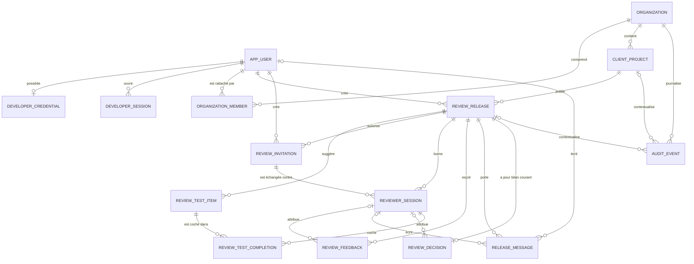
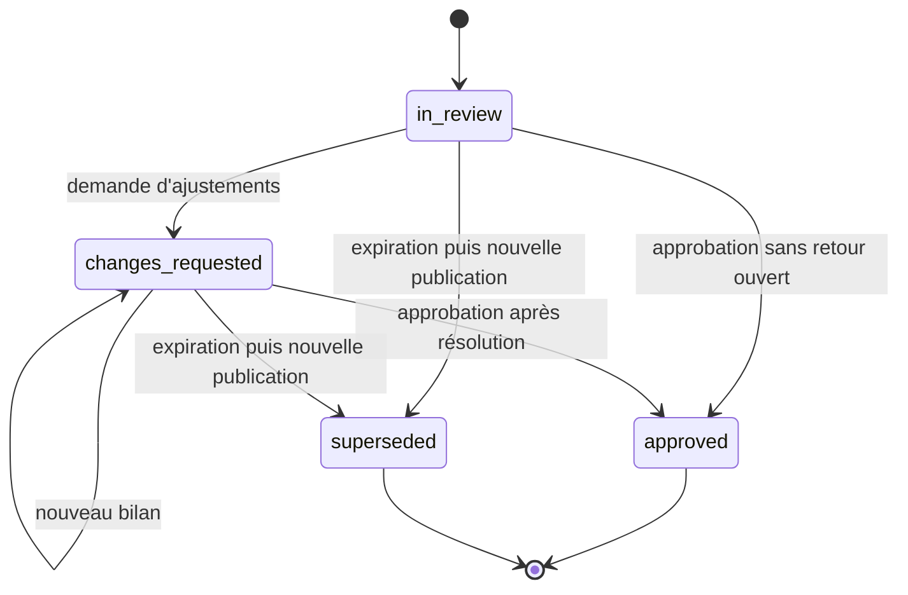
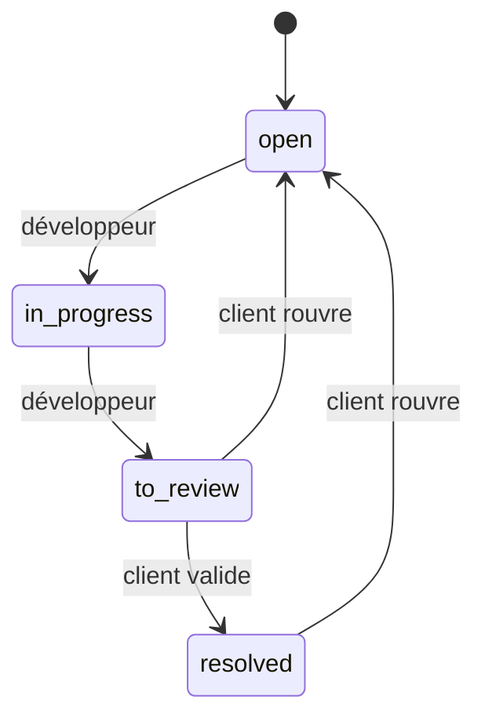
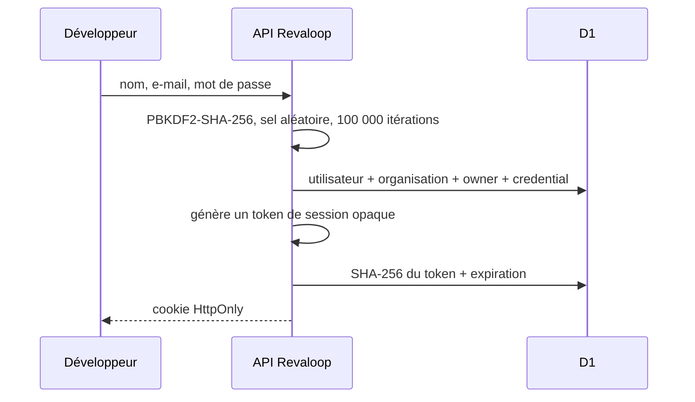
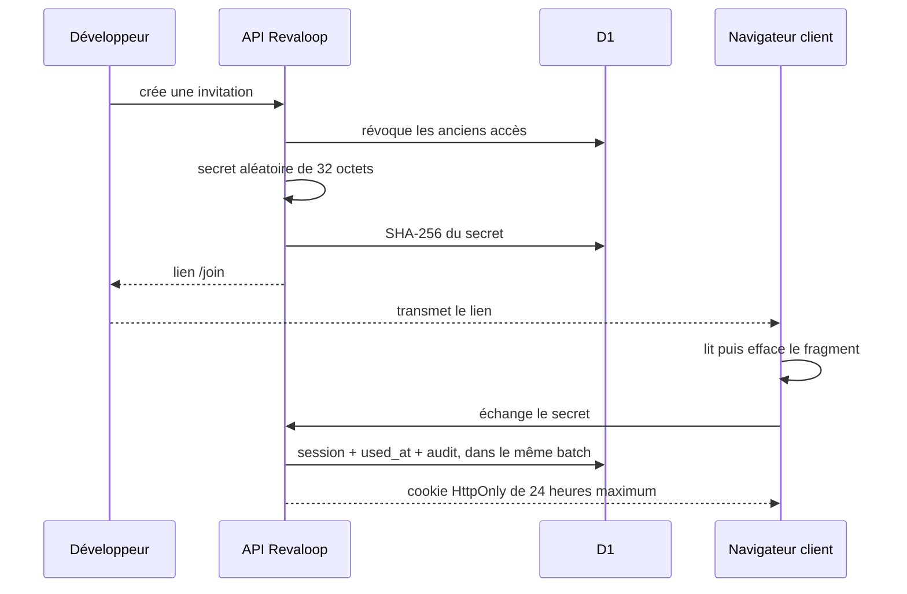

# Modèle conceptuel des données

- **Système :** Revaloop
- **Périmètre :** review plane alpha 0.3
- **Stockage actuel :** Cloudflare D1, dialecte SQLite
- **Dernière vérification :** 25 juillet 2026

## Objet du document

Ce document décrit les données réellement utilisées par Revaloop, leurs
relations, les invariants métier et les contraintes effectivement imposées par
la base.

Il distingue volontairement :

- le **modèle métier**, c’est-à-dire les règles attendues par le produit ;
- le **modèle physique D1**, c’est-à-dire les clés, index et références que la
  base sait refuser seule ;
- les **garanties applicatives**, imposées par les requêtes conditionnelles du
  repository et les validations des routes API.

Une règle écrite dans un type TypeScript ou vérifiée par une route n’est pas
automatiquement une contrainte SQLite.

## Vue conceptuelle

`RATE_LIMIT_BUCKET` est volontairement absent de ce graphe : c’est une donnée
technique autonome, identifiée par une clé calculée à partir du namespace, de la
fenêtre temporelle et d’une empreinte tronquée du sujet limité.

## Entités actives

### Identité et séparation des espaces

| Entité | Rôle | Clés et contraintes physiques |
|---|---|---|
| `app_users` | Identité d’un développeur Revaloop | PK `id`, e-mail unique |
| `developer_credentials` | Dérivé du mot de passe | PK et FK `user_id`, donc zéro ou un credential par utilisateur |
| `developer_sessions` | Session du dashboard | PK `id`, FK utilisateur, `token_hash` unique |
| `organizations` | Espace de travail isolé | PK `id`, slug globalement unique |
| `organization_members` | Association utilisateur/organisation et rôle | PK `id`, FKs utilisateur et organisation, couple `(organization_id, user_id)` unique |

Le schéma autorise une relation plusieurs-à-plusieurs entre utilisateurs et
organisations. L’application alpha sélectionne toutefois le premier membership
par date de création et n’expose pas encore de sélecteur d’organisation.

### Projet et version de recette

| Entité | Rôle | Clés et contraintes physiques |
|---|---|---|
| `client_projects` | Projet appartenant à une organisation | PK `id`, FK organisation, couple `(organization_id, slug)` unique |
| `review_releases` | Version soumise à la recette | PK `id`, FK projet, FK `created_by`, couple `(project_id, version)` unique |
| `review_test_items` | Vérification facultative suggérée au client | PK `id`, FK release, couple `(release_id, position)` unique |

Une release conserve notamment la version et le commit déclarés, l’URL HTTPS de
preview, son état, sa date d’expiration, le compteur atomique
`feedback_sequence` et le signal monotone `preview_revision`.

L’URL et le commit sont déclaratifs. Revaloop ne prouve ni que le contenu
externe correspond au commit, ni qu’il est resté immuable.

### Accès reviewer

| Entité | Rôle | Clés et contraintes physiques |
|---|---|---|
| `review_invitations` | Invitation expirante et révocable | PK `id`, FK release, FK créateur, `token_hash` unique |
| `reviewer_sessions` | Session client après échange | PK `id`, FKs invitation et release, `token_hash` unique |

Le modèle métier considère qu’une invitation à usage unique produit au plus une
session. Le schéma physique ne place toutefois pas de contrainte unique sur
`reviewer_sessions.invitation_id`. La cardinalité physique reste donc
`invitation 1 → 0..N sessions`, tandis que la cardinalité métier visée est
`invitation 1 → 0..1 session`.

L’usage unique est aujourd’hui garanti par le batch d’échange, qui revérifie
`used_at`, les révocations, les expirations et l’état de la release avant
d’insérer la session puis de consommer l’invitation.

### Collaboration et validation

| Entité | Rôle | Clés et contraintes physiques |
|---|---|---|
| `review_feedback` | Retour contextualisé | PK `id`, FK release, FK session auteur nullable, couple `(release_id, sequence)` unique |
| `release_messages` | Discussion générale d’une release | PK `id`, FK release, FKs auteur utilisateur/session nullables |
| `review_decisions` | Bilan courant de la release | PK `id`, FK release, FK session reviewer nullable, `release_id` unique |
| `review_test_completions` | Vérification cochée par une session | PK `id`, FKs session et consigne, couple `(session_id, test_item_id)` unique |

Les références auteur sont nullables afin de conserver le texte, le nom affiché
et la lisibilité historique après la purge éventuelle d’une session ou d’un
utilisateur. Le nom reviewer reste déclaratif : il est choisi par le
développeur lors de l’invitation et ne constitue pas une identité vérifiée.

### Exploitation

| Entité | Rôle | Clés et contraintes physiques |
|---|---|---|
| `audit_events` | Journal minimal des mutations sensibles | PK `id`, FK organisation, FKs projet/release nullables |
| `rate_limit_buckets` | Limitation d’abus par fenêtre | PK `key`, compteur et expiration |

`audit_events.actor_id` n’est volontairement pas une FK. Il peut continuer à
identifier l’acteur interne après la suppression d’une session. Les métadonnées
doivent rester en liste fermée et ne contenir ni secret, cookie, corps de
commentaire ou query sensible.

## Invariants

### Contraintes réellement imposées par D1

- e-mail utilisateur unique ;
- slug organisation unique ;
- membership unique par couple organisation/utilisateur ;
- slug projet unique dans son organisation ;
- version unique dans son projet ;
- un credential maximum par utilisateur ;
- hash unique pour chaque invitation et chaque session ;
- position de consigne unique dans une release ;
- séquence de retour unique dans une release ;
- une seule décision courante par release ;
- une seule complétion par couple session/consigne ;
- références et suppressions en cascade ou à `NULL` selon le schéma.

### Invariants imposés par l’application

Les règles suivantes ne sont pas entièrement représentées par une contrainte
physique :

- une seule invitation non révoquée à la fois pour une release ;
- une invitation ne peut produire qu’une session ;
- la release d’une session doit être celle de son invitation ;
- une complétion doit relier une session et une consigne de la même release ;
- une décision doit être attribuée à une session de la même release ;
- `author_type` doit correspondre à la bonne référence auteur ;
- les rôles, statuts, types et priorités appartiennent à des listes fermées ;
- les coordonnées d’un retour sont comprises entre 0 et 100 ;
- `preview_revision` ne peut qu’augmenter ;
- une release expirée ou clôturée n’accepte plus de mutation ;
- une approbation exige que tous les retours soient résolus ;
- seule une personne membre de l’organisation peut lire ou modifier son projet ;
- seul un propriétaire peut supprimer un projet.

Ces invariants reposent sur les routes de validation, les jointures
d’autorisation et les `INSERT ... SELECT` ou `UPDATE` conditionnels du
repository. Ils doivent donc rester couverts par des tests d’intégration D1.

### États métier

Une release suit principalement le cycle :

`draft` existe dans le type et le schéma, mais le parcours courant publie
directement une release en `in_review`.

Le workflow d’un retour est :

## Flux de données

### Création du compte et connexion

Le mot de passe brut sert uniquement à l’inscription ou à la vérification. D1
conserve le dérivé, le sel et le coût. Le token de session brut reste dans le
cookie ; D1 ne reçoit que son hash.

### Projet et release

Le développeur authentifié crée le projet dans son organisation, sa première
release, zéro à douze consignes facultatives et un événement d’audit.

Une nouvelle release est refusée tant qu’une release non expirée reste
`in_review` ou `changes_requested`. Toute publication suivante révoque les
invitations et sessions de l’ensemble des releases antérieures du projet. Une
release approuvée conserve son état et son historique développeur ; après
expiration, une release encore active est classée `superseded` avant la
création de la nouvelle version.

### Invitation et session reviewer

La durée de session est le minimum entre 24 heures et l’expiration de
l’invitation. L’invitation ne dépasse jamais l’expiration de sa release.

### Lecture de l’espace de revue

Une lecture reviewer :

1. calcule le hash du cookie ;
2. joint session, invitation, release et projet ;
3. vérifie révocations et expirations ;
4. charge retours, décision, consignes, complétions de cette session et
   discussion ;
5. actualise `last_seen_at` au plus une fois toutes les dix minutes.

Une lecture développeur part du compte, rejoint son membership puis limite tous
les projets et releases à l’organisation obtenue.

### Retour, message et décision

La création d’un retour incrémente `feedback_sequence`, insère le retour avec la
nouvelle valeur et écrit l’audit dans un même batch conditionnel.

Les messages sont rattachés à toute la release. Leur auteur et son nom viennent
de la session développeur ou reviewer, jamais d’une identité libre envoyée par
le navigateur.

La décision est un `UPSERT` sur la ligne unique de la release :

- `changes_requested` reste non terminal et peut être remplacé ;
- `approved` exige zéro retour non résolu et clôt définitivement la release.

## Sécurité et confidentialité

### Données protégées par dérivation ou hachage

- mot de passe : PBKDF2-SHA-256, sel aléatoire, coût stocké ;
- token de session développeur : SHA-256 uniquement dans D1 ;
- secret d’invitation : SHA-256 uniquement dans D1 ;
- token de session reviewer : SHA-256 uniquement dans D1 ;
- identifiant de rate limit : SHA-256 tronqué dans la clé de fenêtre.

Les cookies applicatifs sont `HttpOnly`, `SameSite=Strict` et `Secure` en
production. Toutes les mutations web exigent une origine exacte et des corps
JSON bornés.

### Données lisibles par l’exploitant

D1 conserve sous une forme exploitable :

- e-mail et nom affiché du développeur ;
- nom d’organisation ;
- noms et descriptions de projets ;
- URL de staging, commit et message de release ;
- nom reviewer déclaratif et éventuel e-mail fourni par un client API ;
- texte et contexte des retours ;
- messages et décisions ;
- dates et événements d’audit.

Il n’existe pas de chiffrement applicatif de ces colonnes. La localisation, le
chiffrement d’infrastructure, les sauvegardes, les accès opérateur et les
sous-traitants dépendent du déploiement D1/Sites choisi par l’exploitant et
doivent être documentés séparément.

### Données de la preview non collectées

Le review plane ne proxyfie pas la preview. Il ne conserve pas ses cookies, les
valeurs de ses champs, son DOM, ses corps ou headers HTTP, sa query string, ses
fichiers ou sa base de données.

Le bridge facultatif transmet seulement `pathname` et `document.title`.
L’invitation protège l’espace Revaloop, pas l’URL de staging ni la base de
l’application testée.

Le compagnon desktop actuel ne lit pas D1 et ne possède aucun credential API.
Un futur client Electron doit conserver cette séparation : il ne doit jamais
recevoir un accès direct à D1.

## Rétention et suppression

| Donnée | Règle actuelle |
|---|---|
| Invitation | expiration choisie, bornée par la release |
| Session reviewer | 24 heures maximum |
| Session développeur | autorisation 30 jours ; ligne purgée environ 30 jours après expiration ou révocation |
| Bucket de rate limit | supprimé après expiration |
| Session/invitation reviewer ancienne | purge après 30 jours si aucune décision ne la retient |
| Audit | purge après 365 jours |
| Projet, release, consigne, retour, message, décision | conservation jusqu’à la suppression du projet |
| Utilisateur et organisation | aucune suppression self-service actuelle |

La maintenance s’exécute lors du bootstrap d’un isolate. Ce n’est pas un cron :
une instance sans trafic peut conserver des lignes expirées au-delà de leur
durée théorique jusqu’au prochain accès.

La suppression d’un projet, réservée au propriétaire, entraîne en cascade les
releases, consignes, complétions, invitations, sessions, retours, messages et
décisions.

Les événements d’audit peuvent subsister jusqu’à leur propre expiration. Leurs
FK projet et release deviennent `NULL`, mais leurs métadonnées minimales peuvent
encore contenir un identifiant technique.

## Tables historiques 0.1

Quatre tables restent présentes dans le schéma Drizzle et les migrations :

| Table historique | Remplacement actuel |
|---|---|
| `projects` | `client_projects` |
| `releases` | `review_releases` |
| `feedback_items` | `review_feedback` |
| `decisions` | `review_decisions` |

Elles ne sont plus utilisées par les parcours réels. Elles sont conservées
temporairement pour éviter une suppression destructive pendant la migration
expand/contract.

Le bootstrap runtime d’une base vide crée uniquement les seize tables actives,
alors que l’ensemble des migrations `0000` à `0004` aboutit à vingt tables avec
les quatre tables historiques.

## État des migrations

| Migration | Effet |
|---|---|
| `0000_redundant_vance_astro` | modèle historique à quatre tables |
| `0001_sleepy_paper_doll` | modèle multi-tenant, invitations, retours, décisions, audit et rate limits |
| `0002_sticky_mystique` | rend la référence de session d’une décision nullable avec `ON DELETE SET NULL` |
| `0003_sparkling_wrecker` | credentials et sessions développeur, discussion et `preview_revision` |
| `0004_new_ben_parker` | ajoute `review_feedback.author_type` |

Le schéma Drizzle décrit bien l’état final des migrations. Le runtime métier
n’utilise cependant pas Drizzle : le repository exécute du SQL D1 préparé à la
main.

Le build copie les migrations dans `dist/.openai`, mais le dépôt ne contient pas
encore de commande explicite ni de table de version qui les applique et les
trace.

Pour ne pas laisser une ancienne instance dans un état partiellement migré, le
bootstrap appelle aussi `ensureDatabaseCompatibility`. Cette couche
idempotente :

- ajoute `review_releases.preview_revision` si nécessaire ;
- ajoute `review_feedback.author_type` si nécessaire ;
- inspecte `review_decisions` puis la reconstruit, en conservant ses données, si
  `reviewer_session_id` n’est pas nullable ou si sa FK n’utilise pas
  `ON DELETE SET NULL`.

Ce mécanisme répare les écarts structurels actuellement connus entre les
migrations `0001` et `0004`. Il ne remplace pas un système général de migrations
versionnées : une prochaine évolution de schéma devra être ajoutée explicitement
à cette couche ou, de préférence, appliquée par un vrai migration runner.

## Limites physiques connues

1. Les valeurs `enum` de Drizzle sont des indications TypeScript. Les tables
   SQLite n’ont actuellement aucun `CHECK` pour les rôles, états, types ou
   priorités.
2. `reviewer_sessions.invitation_id` n’est pas unique.
3. Les correspondances de release entre session, invitation, consigne,
   complétion et décision ne sont pas garanties par une clé composite.
4. Les tables de messages permettent physiquement des références auteur
   incohérentes avec `author_type`.
5. `position_x` et `position_y` sont déclarés `INTEGER`, alors que l’API stocke
   des pourcentages pouvant comporter deux décimales.
6. Les dates sont des textes ISO. Le bon ordre chronologique dépend de l’usage
   systématique de `toISOString()`.
7. La purge est opportuniste et aucune suppression de compte ou d’organisation
   n’est disponible.
8. Les migrations `0000 → 0004` sont maintenant exécutées dans SQLite avec les
   FK actives. La compatibilité runtime depuis `0001` est testée avec
   conservation des données et idempotence. Les courses métier ne sont pas
   encore testées contre une vraie base D1.

## Plan recommandé avant la première release

### Priorité 1 — migrations reproductibles

- ajouter une commande de migration explicite avec table de version ;
- intégrer cette commande au déploiement et vérifier son historique ;
- étendre les tests de compatibilité aux futures versions de schéma ;
- refuser le démarrage si la version physique attendue n’est pas présente ;
- ne conserver le bootstrap automatique que pour une base réellement vide,
  puis le retirer lorsque le déploiement applique toujours les migrations.

### Priorité 2 — migration corrective

Préparer une migration suivante qui :

- aligne le type des coordonnées sur leur précision réelle ;
- ajoute les `CHECK` compatibles avec SQLite ;
- impose une session maximum par invitation ;
- renforce les liens de même release avec des clés composites ou des triggers
  documentés.

### Priorité 3 — tests d’intégration D1

Couvrir au minimum :

- deux inscriptions bootstrap concurrentes ;
- deux échanges simultanés de la même invitation ;
- révocation pendant une création de retour ou de message ;
- retour concurrent avec une approbation ;
- demandes d’ajustements successives puis approbation ;
- isolement de deux organisations connaissant les mêmes identifiants ;
- suppressions en cascade et passage des références d’audit à `NULL` ;
- purge d’une session référencée ou non par une décision.

### Priorité 4 — gouvernance des données

- planifier une purge indépendante du trafic ;
- ajouter l’export complet, incluant discussion et révision de preview ;
- définir la suppression de compte et d’organisation ;
- documenter région, sauvegardes, restauration, sous-traitants et demandes de
  suppression ;
- fixer une durée contractuelle de conservation par type de projet.

### Priorité 5 — contrôle avant diffusion

- exécuter une sauvegarde et une restauration de test ;
- vérifier les migrations sur une copie de la D1 de préproduction ;
- lancer les scénarios de concurrence ;
- conserver une preview et une base de test sans donnée réelle ;
- ne pas présenter une approbation Revaloop comme une signature contractuelle
  sans processus de recette ou de signature séparé.

## Sources de vérité

- schéma : `db/schema.ts` ;
- SQL métier et maintenance : `db/repository.ts` ;
- mises à niveau runtime idempotentes : `db/compatibility-migrations.ts` ;
- connexion Drizzle : `db/index.ts` ;
- migrations : `drizzle/` ;
- tests de migration : `tests/database-migrations.test.mjs` ;
- primitives d’authentification : `lib/developer-auth-core.ts` et
  `lib/security.ts` ;
- limites de cycle de vie : `docs/DATA_LIFECYCLE.md` ;
- risques : `docs/THREAT_MODEL.md`.

Toute évolution d’identité, de stockage, de relation, de suppression ou de
rétention doit mettre à jour ce document, le schéma, une migration, les tests et
le modèle de menace.
