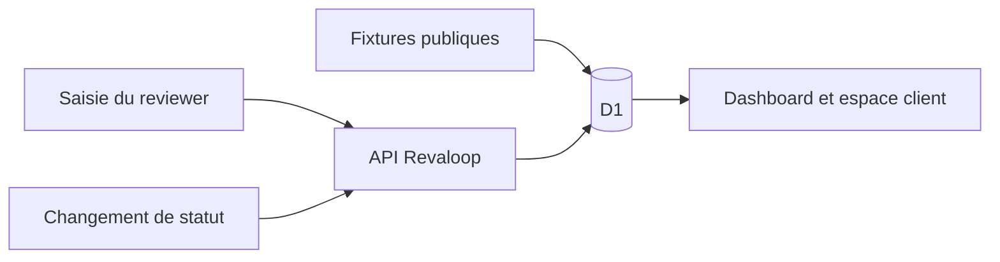

# Cycle de vie des données

- **Statut :** état actuel et exigences cibles
- **Dernière vérification :** 24 juillet 2026

## Résumé

Le prototype stocke dans D1 un projet fictif, une release, des retours et des
décisions. Il ne propose actuellement ni suppression, ni export, ni purge
automatique. R2 est désactivé et aucune capture n’est conservée.

N’utilisez que des données synthétiques.

## Données actuelles

### Fixtures du dépôt

`lib/revaloop.ts` contient :

- le projet fictif Maison Matisse ;
- la release fictive `v1.2` ;
- le token public `maison-matisse-v12` ;
- quatre retours fictifs ;
- des noms fictifs utilisés dans la démonstration.

Ces valeurs sont publiques dès que le code source l’est.

### Base D1

Au premier accès, `db/repository.ts` crée et initialise :

| Table | Données |
|---|---|
| `projects` | nom, slug, description, couleur et date |
| `releases` | version, titre, commit déclaré, état, token en clair et dates |
| `feedback_items` | titre, texte, type, priorité, page, viewport, position, auteur et dates |
| `decisions` | décision, auteur, note et date |

Les retours et décisions créés depuis l’interface sont persistés dans D1 si le
binding est disponible.

### Données non collectées actuellement

Le prototype ne collecte pas :

- mot de passe ;
- cookie d’une application cliente ;
- trafic d’un serveur local ;
- capture d’écran ;
- fichier joint ;
- adresse IP dans le modèle métier ;
- télémétrie produit dédiée ;
- donnée R2.

L’infrastructure d’hébergement peut néanmoins produire ses propres logs
techniques selon sa configuration.

## Flux

Les erreurs serveur sont envoyées à `console.error`. Le code actuel ne
journalise volontairement ni le corps des commentaires ni les tokens, mais
aucune politique d’observabilité centralisée ne garantit encore cette
propriété.

## Durée de conservation actuelle

La conservation est indéfinie tant que la base D1 n’est pas réinitialisée ou
supprimée manuellement.

Le champ `expires_at` d’une release :

- est affiché comme information de démonstration ;
- bloque la lecture et les mutations après son échéance ;
- ne supprime aucune donnée ;
- ne permet ni rotation ni révocation manuelle du token.

Il ne constitue donc pas une politique de rétention.

## Suppression et export actuels

Il n’existe aucune route permettant :

- de supprimer un retour ;
- de supprimer une décision ;
- de supprimer un projet ou une release ;
- d’exporter un espace ;
- de purger les fixtures ;
- de prouver la suppression.

Ces fonctions bloquent toute utilisation avec des données client réelles.

## Classification cible

| Catégorie | Exemples | Niveau par défaut |
|---|---|---|
| Identité | e-mail développeur, nom reviewer | personnel |
| Métadonnée projet | nom, branche, commit, URL | interne |
| Retour | commentaire, décision, contexte navigateur | confidentiel client |
| Capture | écran du produit, contenu visible | potentiellement sensible |
| Secret d’accès | invitation, session, clé agent | secret |
| Trafic tunnel | headers, cookies, corps HTTP | très sensible |
| Audit | acteur, action, ressource, date | interne et personnel |

La capture et le trafic doivent être traités selon leur contenu réel, pas selon
leur simple nom technique.

## Politique cible du review plane

Avant une utilisation réelle, chaque type de donnée doit avoir :

- une finalité ;
- une base de collecte documentée ;
- une durée par défaut ;
- une action d’export ;
- une action de suppression ;
- un propriétaire ;
- une liste de sous-traitants et de régions ;
- une procédure en cas de violation.

Valeurs de produit envisagées, à confirmer avant implémentation :

| Donnée | Durée proposée |
|---|---|
| invitation non utilisée | jusqu’à expiration, maximum 7 jours |
| session reviewer | durée courte, maximum 24 heures |
| retours et décisions | durée du projet puis période configurable |
| captures | même durée que le retour associé |
| audit de sécurité | durée distincte et justifiée |
| logs techniques | durée minimale nécessaire au diagnostic |

Ces durées ne sont pas encore appliquées et ne constituent pas un engagement
contractuel.

## Invitations et sessions cibles

Le secret d’invitation :

1. est généré aléatoirement ;
2. n’est montré qu’au créateur ;
3. voyage dans le fragment de l’URL de jonction ;
4. est échangé une fois contre une session ;
5. est stocké uniquement sous forme hachée ;
6. est révoqué ou expiré côté serveur ;
7. n’apparaît pas dans l’audit, les logs ou l’analytics.

La session reviewer utilise un cookie opaque, `Secure`, `HttpOnly` et expirant.

Voir [ADR-0002](adr/0002-reviewer-authentication.md).

## Captures futures

R2 n’est pas activé aujourd’hui. Lorsqu’il le sera :

- bucket privé uniquement ;
- upload après autorisation ;
- choix explicite de la personne avant chaque capture ;
- prévisualisation avant envoi ;
- avertissement sur les données visibles ;
- contrôle de type réel, taille et dimensions ;
- suppression des métadonnées inutiles ;
- identifiant objet non dérivé du nom client ;
- accès par route autorisée ou URL signée courte ;
- suppression de l’objet avec son retour ;
- procédure couvrant les copies et sauvegardes.

La capture automatique en arrière-plan est hors périmètre de la première
version.

## Trafic du futur tunnel

Le mode managé permettra au relais de lire le trafic HTTP après terminaison
TLS. Par défaut, Revaloop ne devra stocker :

- ni corps de requête ou de réponse ;
- ni cookie ;
- ni header d’autorisation ;
- ni contenu de formulaire.

Les métriques autorisées devront être définies par liste fermée, par exemple :

- identifiant interne de tunnel ;
- code de statut agrégé ;
- volume d’octets ;
- durée ;
- erreur de transport sans URL sensible.

Le mode passthrough futur vise à rendre le contenu opaque au relais, mais sa
faisabilité n’est pas établie.

## Auto-hébergement et sous-traitants

Le dépôt ne fournit pas encore un auto-hébergement opérationnel. Une future
distribution devra documenter séparément :

- PostgreSQL ou autre base compatible ;
- S3/MinIO ou autre stockage objet ;
- sauvegarde et restauration ;
- purge et réversibilité ;
- régions d’hébergement ;
- accès support ;
- sous-traitants éventuels ;
- transferts hors EEE le cas échéant.

Open source ne signifie pas absence de sous-traitant : l’entité qui opère
l’instance et les services choisis détermine la chaîne réelle.

## Demandes d’exercice et incidents

Avant toute donnée réelle, le produit devra pouvoir :

- rechercher les données associées à une personne ;
- exporter les données dans un format exploitable ;
- corriger l’identité affichée ;
- supprimer ou anonymiser selon les obligations applicables ;
- consigner une violation ;
- identifier les projets et sous-traitants touchés ;
- notifier rapidement le responsable du traitement.

Les rôles juridiques dépendent du déploiement et du contrat. Ce document est
une spécification technique, pas un avis juridique.

## Checklist de pull request

Toute nouvelle donnée doit répondre à ces questions :

- Pourquoi est-elle nécessaire ?
- Qui peut la lire et la modifier ?
- Dans quel stockage et quelle région réside-t-elle ?
- Figure-t-elle dans un log, une sauvegarde ou une analytics ?
- Quand et comment est-elle supprimée ?
- Peut-elle être exportée ?
- Est-elle transmise à un tiers ?
- Quel test prouve l’autorisation ?
- Le modèle de menace a-t-il été mis à jour ?
