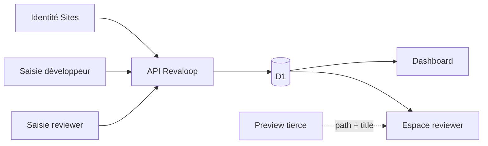

# Cycle de vie des données

- **Version :** alpha 0.2
- **Dernière vérification :** 25 juillet 2026

## Résumé

Revaloop conserve les métadonnées nécessaires à une recette, pas le trafic de
la preview. Le développeur peut exporter une recette en Markdown et supprimer
un projet complet. Les données opérationnelles expirées sont purgées de façon
opportuniste.

Cette politique technique ne remplace ni un registre de traitement, ni un
contrat, ni un avis juridique.

## Données publiques du dépôt

`lib/revaloop.ts` contient la démonstration fictive Maison Matisse :

- projet et release synthétiques ;
- noms fictifs ;
- retours fictifs ;
- identifiant `maison-matisse-v12`.

Ces valeurs sont publiques. `/demo` ne lit et n’écrit aucune donnée réelle.

## Données D1

| Catégorie | Données | Finalité |
|---|---|---|
| identité développeur | e-mail, nom affiché, dernière activité | connexion et autorisation |
| organisation/membre | nom d’espace, rôle | isolation |
| projet | nom, description, slug, dates | classement |
| release | version, titre, commit déclaré, URL HTTPS, message, dates | cible de recette |
| consigne | titre, description, ordre | guider la cliente |
| invitation | hash, nom reviewer déclaratif, e-mail API nullable, expiration, usage, révocation | créer l’accès |
| session | hash, nom reviewer, activité, expiration, révocation | autoriser la recette |
| retour | texte, type, priorité, chemin, titre, viewport, position, auteur, dates | collaboration |
| décision courante | état, note, auteur, date | demander des ajustements ou clôturer par approbation |
| audit | acteur interne, action, ressource, métadonnées minimales, date | sécurité |
| rate limit | clé contenant un hash tronqué, compteur, expiration | limiter l’abus |

Le secret d’invitation et le token de session ne sont jamais stockés en clair.
Le nom reviewer est saisi par le développeur et ne prouve pas l’identité de la
personne qui utilise le lien. L’interface fournie ne collecte plus d’e-mail
reviewer. L’API et le schéma conservent un champ nullable pour compatibilité
avec des clients personnalisés ; s’il est alimenté, il ne déclenche aucun envoi
et ne prouve pas davantage l’identité.

## Données non collectées

Revaloop ne collecte pas :

- mot de passe ;
- moyen de paiement ;
- cookie de la preview ;
- valeur de champ ou contenu DOM ;
- corps ou header du trafic applicatif ;
- query string de la preview ;
- capture ou fichier ;
- vidéo ou audio ;
- donnée R2 ;
- trafic d’un serveur local.

Le bridge facultatif transmet uniquement `pathname` et `document.title`. Il ne
transmet ni scroll, ni ancre d’élément, ni sélecteur DOM. Le repère visuel reste
donc approximatif, y compris avec instrumentation.

L’adresse réseau peut être utilisée momentanément pour le rate limiting par
l’infrastructure. Le modèle métier ne la conserve pas ; D1 reçoit une empreinte
tronquée associée à une fenêtre courte.

## Flux

La preview tierce est directement chargée dans le navigateur. Son opérateur et
ses sous-traitants ont leur propre cycle de données, indépendant de Revaloop.
L’invitation protège les données de revue, pas l’accès au staging ni les données
saisies dans celui-ci.

## Expiration et rétention

| Donnée | Règle actuelle |
|---|---|
| invitation | 1 à 14 jours dans l’UI, jamais au-delà de la release |
| session reviewer | au plus 24 heures |
| release `in_review` ou `changes_requested` non expirée | bloque la publication d’une nouvelle release |
| release active expirée | accès déjà invalide ; passée à `superseded` et révoquée lors de la publication suivante |
| release approuvée | terminale ; une nouvelle release peut ensuite être publiée |
| bucket de rate limit | supprimé après expiration |
| session/invitation opérationnelle ancienne | purge après 30 jours lorsqu’aucune décision ne la retient |
| audit | purge après 365 jours |
| projet, release, retour, décision | jusqu’à suppression du projet |
| utilisateur/organisation | pas encore de suppression self-service |

La maintenance s’exécute au bootstrap d’un isolate. Ce n’est pas un cron à
heure garantie : une instance inactive peut conserver les données plus
longtemps jusqu’au prochain accès.

Une release conserve une seule ligne de décision courante. Une demande
`changes_requested` peut être remplacée par un bilan ultérieur ; `approved` est
terminal. La décision conserve le nom déclaratif de son auteur même si la
référence de session est ensuite supprimée. Cette dénormalisation préserve la
lisibilité de la recette sans authentifier cette personne.

## Export

Le dashboard génère un fichier Markdown local contenant :

- projet et release ;
- URL déclarée et statut ;
- chaque retour, son contexte et son état ;
- décision éventuelle ;
- date de l’export.

Le fichier est construit dans le navigateur. Revaloop ne stocke pas une copie
supplémentaire de cet export.

## Suppression

Le propriétaire peut supprimer un projet depuis le dashboard. D1 supprime en
cascade :

- releases ;
- consignes et complétions ;
- invitations et sessions ;
- retours ;
- décisions.

L’audit organisationnel peut subsister jusqu’à sa rétention avec les références
de projet/release mises à `NULL`. Il ne doit contenir ni secret ni corps de
commentaire.

Il n’existe pas encore :

- de suppression d’un retour isolé ;
- de suppression de compte/organisation self-service ;
- de preuve cryptographique de suppression ;
- de contrôle utilisateur des sauvegardes de l’hébergeur.

Ces limites doivent être évaluées avant toute donnée personnelle réelle.

## Logs

Les erreurs inattendues sont envoyées à `console.error` avec un message
générique. Le code ne journalise volontairement ni secret, cookie, corps de
retour, e-mail reviewer ni URL avec query.

L’opérateur Sites/Cloudflare peut produire ses propres logs techniques selon
sa configuration. L’entité qui déploie l’instance doit documenter région,
accès, sauvegarde et sous-traitants.

## Captures futures

Si R2 est ajouté :

- bucket privé ;
- consentement avant chaque capture ;
- prévisualisation avant envoi ;
- contrôle du contenu réel, MIME, taille et dimensions ;
- suppression des métadonnées inutiles ;
- identifiant non dérivé d’un nom client ;
- accès par route autorisée ou URL signée courte ;
- suppression de l’objet avec le retour ;
- quota par organisation.

Les captures automatiques en arrière-plan restent hors périmètre.

## Futur tunnel

Le mode managé pourra exposer le trafic au relais après terminaison TLS. Par
défaut, aucun corps, cookie, header d’autorisation ou contenu de formulaire ne
devra être stocké.

Seules des métriques en liste fermée pourront être conservées : identifiant
interne, code agrégé, volume, durée et erreur de transport sans URL sensible.

## Checklist pour une nouvelle donnée

- Pourquoi est-elle nécessaire ?
- Qui peut la lire et la modifier ?
- Où et dans quelle région réside-t-elle ?
- Est-elle copiée dans un log, audit, export ou backup ?
- Quelle est sa durée ?
- Comment l’exporter et la supprimer ?
- Est-elle transmise à un tiers ?
- Quel test prouve l’autorisation ?
- Le modèle de menace et le contrat sont-ils à jour ?
