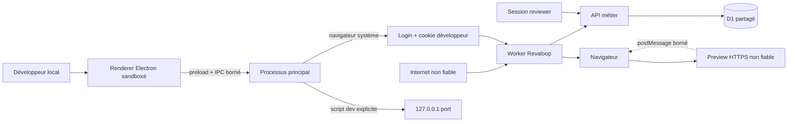
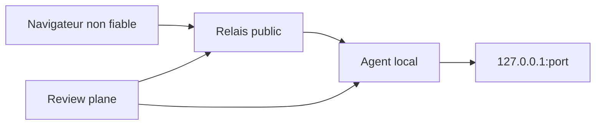

# Modèle de menace

- **Système :** Revaloop
- **Version :** 0.3 en cours
- **Dernière vérification :** 25 juillet 2026
- **Statut :** alpha pour pilote contrôlé, aucune donnée sensible

## Objectif

Ce document distingue les contrôles réellement implémentés des exigences du
futur tunnel. Il ne remplace ni revue de code, ni pentest, ni analyse juridique.

## Périmètre actuel

Inclus :

- landing et démo fictive ;
- dashboard développeur ;
- compte, credential et session développeur Revaloop ;
- projets, releases, invitations, sessions, retours, messages et décisions ;
- signal de révision de preview ;
- preview HTTPS tierce dans une iframe ;
- bridge facultatif `postMessage` ;
- API et D1 ;
- Worker et en-têtes ;
- compagnon desktop Electron local, sélection de projet, processus, logs en
  mémoire et ouverture du navigateur système ; runtime Tauri 2 conservé comme
  fallback.

Hors périmètre :

- proxy ou tunnel vers `localhost` ;
- agent et relais ;
- capture ou R2 ;
- preview construite dans un runner ;
- auto-hébergement qualifié ;
- données de production ou réglementées.

## Actifs

- identité et appartenance du développeur ;
- dérivé et sel du mot de passe développeur ;
- token de session développeur ;
- séparation entre organisations et projets ;
- secret d’invitation et token de session ;
- nom déclaratif du reviewer ;
- e-mail reviewer nullable pour clients API personnalisés, non collecté par
  l’interface fournie ;
- URL, commit et consignes de release ;
- contenu et contexte des retours ;
- discussion partagée d’une release ;
- compteur de révision déclaré de la preview ;
- bilan courant et approbation finale ;
- audit ;
- disponibilité et budget D1 ;
- chemin du projet local, script `dev`, URL loopback et origine Revaloop
  configurée ;
- processus enfant lancé par le compagnon et journal local éphémère ;
- confiance dans les limites affichées.

Le contenu, les cookies et la base de la preview sont des actifs de
l’application tierce. Revaloop ne doit pas les collecter.

## Acteurs

- visiteur anonyme ;
- développeur authentifié ;
- reviewer possédant une invitation ou session ;
- autre utilisateur Revaloop dans son propre tenant si l’inscription est
  explicitement ouverte ;
- attaquant Internet ;
- reviewer malveillant ;
- preview tierce compromise ;
- opérateur Sites/Cloudflare ;
- dépendance ou chaîne de build compromise ;
- projet local malveillant ou compromis ;
- autre processus du compte système et poste local compromis ;
- futur agent ou relais compromis.

## Frontières



Hypothèses :

- le build de production est servi en HTTPS ;
- D1 exécute un batch séquentiel de façon transactionnelle ;
- le développeur contrôle ou approuve l’URL de staging ;
- la cliente n’entre que des données fictives ;
- le compte et le système d’exploitation du poste développeur ne sont pas déjà
  compromis ;
- le développeur ne confirme l’exécution que pour un projet qu’il juge fiable.

## Invariants implémentés

### Développeur

- mot de passe de 12 à 128 caractères dérivé avec PBKDF2-SHA-256 Web Crypto,
  sel aléatoire et 600 000 itérations ;
- mot de passe brut jamais stocké ;
- token de session opaque dont seul le SHA-256 est stocké ;
- cookie développeur `HttpOnly`, `Secure` en production, `SameSite=Strict`,
  sans `Domain`, valable au plus 30 jours ;
- session révocable côté serveur ;
- message d’erreur de login générique, calcul factice pour un compte absent et
  rate limits par compte/adresse ;
- inscription bootstrap conditionnée à l’absence de tout credential, jusque
  dans le batch final ;
- identité obligatoire sur pages et API développeur ;
- chaque ressource est résolue avec membre + organisation + projet ;
- un identifiant seul ne donne aucun droit ;
- suppression réservée au propriétaire.

### Invitation et session

- secret aléatoire de 32 octets ;
- uniquement son SHA-256 en D1 ;
- fragment absent du premier GET ;
- invitation one-shot ;
- échange session + consommation + audit atomique ;
- cookie opaque `Secure`, `HttpOnly`, `SameSite=Strict` ;
- durée maximale de 24 heures ;
- correspondance session/invitation/release vérifiée ;
- expiration et révocation vérifiées à la lecture et dans l’écriture finale ;
- fermeture de session côté serveur ;
- rotation révoquant les anciens accès ;
- nouvelle release interdite tant que la courante non expirée est
  `in_review` ou `changes_requested`.

### Autorisation métier

```text
développeur → membership → organisation → projet → release → ressource
reviewer → token hash → session → invitation → release → ressource
```

- transitions développeur et reviewer distinctes ;
- auteur reviewer issu de la session, avec nom déclaratif non authentifié ;
- séquence et insertion du retour dans le même batch ;
- une ligne de décision courante par release ;
- `changes_requested` non terminal et remplaçable par un bilan ultérieur ;
- approbation conditionnée à zéro retour ouvert dans le SQL d’insertion ;
- release approuvée ou remplacée non mutable ;
- checklist et retours encore actifs après une demande d’ajustements, bloqués
  seulement après approbation, remplacement ou expiration.
- messages liés à une release, auteur dérivé de la session développeur ou
  reviewer ;
- incrément de `preview_revision` réservé au développeur de l’organisation ;
- vérifications suggérées facultatives : leur absence ne bloque ni retour ni
  décision.

### Entrées et navigateur

- `Origin` exact sur toutes les mutations ;
- JSON et tailles bornés ;
- valeurs d’état/type/priority en listes fermées ;
- React encode les textes ;
- URL preview HTTPS, sans credentials, query ni localhost distant ;
- `event.origin` et `event.source` vérifiés pour le bridge ;
- bridge limité au pathname et titre, sans scroll ni ancre DOM ;
- CSP, `DENY`, `nosniff`, `no-referrer`, Permissions Policy ;
- routes privées non mises en cache et non indexables.

### Logs et audit

- aucun secret, cookie, corps de retour ou query sensible dans l’audit ;
- métadonnées en liste fermée ;
- audit conditionné à l’existence de la mutation ;
- hash tronqué pour les buckets de rate limit ;
- purge des buckets et audit ancien.

### Compagnon desktop local

- assets React/Vite locaux ; build empaqueté servi par `revaloop://app` avec
  host exact, confinement au dossier du renderer, méthode `GET` uniquement, CSP
  et en-têtes défensifs ;
- origine Vite de développement limitée exactement à
  `http://127.0.0.1:1420/` ;
- sandbox globale et renderer, `contextIsolation: true`, `webSecurity: true`,
  toutes les variantes de `nodeIntegration` désactivées, WebView et contenu
  mixte refusés ;
- preload limité à un bridge gelé de commandes sémantiques, sans exposition de
  Node, `ipcRenderer`, shell, filesystem ou client HTTP générique ;
- contrôle de chaque sender IPC : fenêtre active exacte, `mainFrame` exacte et
  URL locale exacte ;
- refus des nouvelles fenêtres, navigations hors origine, WebViews, permissions
  et téléchargements ;
- `package.json` régulier, borné à 1 Mio et relu avant exécution ;
- script `dev` présenté et confirmation explicite obligatoire ;
- chemin canonique autoritaire détenu par le processus principal ; aucun chemin
  de projet accepté par le handler de démarrage ;
- commande native fixe `npm --ignore-scripts run dev`, lancée avec
  `shell: false`, sans `predev`, `postdev` ni interpolation fournie par le
  renderer ;
- retrait de `NODE_OPTIONS`, `NODE_PATH`, `NPM_CONFIG_NODE_OPTIONS` et des
  variables Electron internes de Revaloop avant de lancer le projet ;
- un seul processus géré ; arrêt limité à son groupe sur Unix ou à son arbre
  sur Windows ;
- URL de preview limitée à une IP loopback, avec normalisation de `localhost`,
  sans credential, query string ni fragment ;
- origine du review plane en HTTPS, HTTP limité au loopback ;
- destinations externes en liste fermée puis ouvertes dans le navigateur
  système ;
- aucun appel API, token ou cookie web dans le desktop ;
- configuration locale sans secret, fichier `0600` sur Unix ;
- logs en mémoire : ligne limitée à 2 000 caractères, marqueurs sensibles
  masqués, maximum de 20 000 événements émis par lancement et 250 lignes
  conservées dans l’interface ;
- fermeture de l’application déclenchant l’arrêt du processus géré ;
- fuses de distribution : RunAsNode, `NODE_OPTIONS`, inspection CLI et
  chargement hors ASAR désactivés, intégrité ASAR activée ;
- Tauri 2 maintenu comme fallback explicite sans devenir le runtime par défaut.

## Registre des risques actuels

| ID | Menace | Contrôle | Risque résiduel / action |
|---|---|---|---|
| T01 | prise de contrôle du bootstrap | inscription fermée après le premier credential, condition finale en D1 | initialiser le compte avant ouverture publique |
| T02 | accès croisé tenant | joins membre/org/projet | ajouter tests intégration à deux identités |
| T03 | rejeu invitation | `used_at`, hash, batch atomique | bearer transférable avant premier usage |
| T04 | vol session reviewer | HttpOnly/Secure/Strict, 24 h, révocation | possession du navigateur suffit pendant la durée |
| T05 | CSRF | Strict + `Origin` | vérifier les futurs clients natifs séparément |
| T06 | écriture après révocation | garde dans SQL final | étendre les tests de concurrence D1 |
| T07 | approbation avec retour ouvert | transaction conditionnelle | maintenir tests de course |
| T08 | faux auteur | auteur dérivé de la session | nom d’invitation saisi par le développeur, possession du lien et identité réelle non vérifiées |
| T09 | fuite via URL preview | credentials/query refusés | hostname et path restent des métadonnées internes |
| T10 | preview malveillante | origine séparée, iframe sandbox, aucun secret exposé | `allow-same-origin` + scripts nécessaire à la preview ; surveiller |
| T11 | origine iframe trop large | src choisi par développeur, `frame-src https:` | instance fermée : allowlist recommandée |
| T12 | framing ou fonction embarquée refusés | aide temporisée + nouvel onglet | pas de détection fiable de XFO ; cookies tiers, OAuth, top-navigation, téléchargements et Permissions Policy peuvent casser un parcours |
| T13 | contenu externe mutable | libellé et commit déclaratif | aucune preuve d’immuabilité |
| T14 | annotation trompeuse | chemin/viewport filtrés + limite affichée | bridge ou non, aucun ancrage DOM/scroll ; position approximative |
| T15 | abus D1 | rate limits, tailles, purge | quotas globaux manquants |
| T16 | rétention excessive | expiration, purge, suppression projet | pas de suppression compte/org self-service |
| T17 | dépendance compromise | lockfile et revue | ajouter scans/provenance de release |
| T18 | Site globalement privé | protège tout | cliente externe bloquée |
| T19 | instance publique | dashboard protégé par cookie Revaloop et bootstrap fermé | aucune vérification e-mail, MFA ou récupération de compte |
| T20 | décision prise pour un mauvais contenu | preview mutable | procès-verbal externe si enjeu contractuel |
| T21 | force brute du login | PBKDF2 600k, réponse générique, limites compte/IP | pas de MFA ni alerte de connexion |
| T22 | vol session développeur | token opaque haché, cookie Host/HttpOnly/Secure/Strict, expiration et révocation | pas d’écran pour révoquer toutes les sessions |
| T23 | faux signal de correctif | incrément autorisé de `preview_revision` | ne prouve ni déploiement, ni commit, ni contenu servi |
| T24 | message attribué au mauvais acteur | auteur dérivé de la session et release autorisée | nom reviewer déclaratif, pas d’identité forte |
| T25 | projet local malveillant, secret ambiant ou écoute LAN | sélection, affichage du script, consentement, hooks npm adjacents désactivés, options Node/Electron internes retirées et `HOST=127.0.0.1` fourni | le script `dev` garde les droits du compte, reçoit les autres variables ambiantes et peut ignorer `HOST` ou ouvrir une autre interface |
| T26 | renderer Electron compromis ou abus IPC | assets locaux, sandbox/context isolation, bridge sémantique, sender/frame/URL exacts, aucune primitive shell ou filesystem générique | une XSS locale pourrait appeler les commandes autorisées ; Chromium + Node augmentent la surface de dépendances par rapport à Tauri |
| T27 | pivot réseau depuis le probe | IP loopback et port explicites, aucun redirect HTTP suivi | un service local accessible au compte peut recevoir une connexion TCP |
| T28 | fuite dans les logs desktop | mémoire uniquement, plafond de lignes, masquage de marqueurs sensibles | un secret sans marqueur reconnu peut encore être affiché par le projet |
| T29 | persistance locale excessive | chemin et URL non secrètes uniquement, permissions compte | le chemin peut révéler un nom de client à un autre processus du même compte |
| T30 | binaire desktop altéré | aucun artefact public annoncé, fuses configurés pour le packaging local | signature, notarisation, provenance, validation des fuses et updater signé requis avant distribution |
| T31 | affaiblissement de l’auth pour le natif | aucune API native actuelle, cookies confinés au navigateur | implémenter PKCE, tokens appareils et révocation avant tout accès API desktop |

T01, T02, T06, T07, T19, T21 et T22 demandent une validation d’intégration avant une
publication générale.

## Preview externe

La preview connaît l’adresse IP de la cliente et reçoit ses propres cookies
selon sa politique. Revaloop ne peut pas rendre privée une URL déjà publique.
L’invitation et le cookie reviewer protègent uniquement le plan de revue ; ils
ne sont jamais transmis à la preview et ne constituent pas son contrôle
d’accès.

Règles :

- staging dédié ;
- base et services sandbox ;
- aucune donnée réelle demandée ;
- origine distincte du portail ;
- pas de récupération serveur générique ;
- sandbox iframe ;
- `postMessage` à schéma fermé ;
- fallback nouvel onglet ;
- origine explicite dans `frame-ancestors` côté preview ;
- authentification et cookies cross-site testés sur les navigateurs cibles ;
- OAuth/SSO, popups, top-navigation et téléchargements testés ou basculés vers
  le nouvel onglet ;
- paiement, caméra, microphone et géolocalisation exclus du parcours embarqué
  par la `Permissions-Policy` actuelle ;
- aucune promesse d’immuabilité.

`allow-scripts` et `allow-same-origin` sont nécessaires pour une application
moderne. Comme la preview est cross-origin, elle ne peut pas lire le DOM ou les
cookies Revaloop. Ne jamais servir une preview non fiable sous l’origine
Revaloop. Le sandbox autorise aussi formulaires, modales et popups, mais pas
top-navigation ni téléchargement. Le bridge ne transmet que le chemin et le
titre ; il ne suit pas le scroll interne et n’ancre pas un retour à un élément.

## D1 et concurrence

Les invariants critiques utilisent des batches conditionnels. Un statement à
zéro changement n’est pas une erreur SQL ; c’est pourquoi :

- les inserts vérifient eux-mêmes le statut/session ;
- les updates dépendent de l’identifiant inséré ;
- les audits utilisent `INSERT ... SELECT WHERE EXISTS` ;
- l’application vérifie `meta.changes`.

La suite doit continuellement tester :

- deux échanges simultanés ;
- révocation pendant un retour ;
- retour pendant une approbation ;
- demandes d’ajustements successives puis approbation ;
- deux tenants avec identifiants connus.

## Futur data plane



| ID | Menace future | Porte d’entrée obligatoire |
|---|---|---|
| F01 | pivot réseau / SSRF | cible loopback exacte, aucune URL arbitraire |
| F02 | proxy ouvert | lease signé et hostname lié, pas de CONNECT générique |
| F03 | détournement | mTLS, clés courtes, rotation et révocation |
| F04 | confusion de tunnels | routage serveur et tests inter-projets |
| F05 | fuite de cookies/corps | logs sans contenu et divulgation du mode managé |
| F06 | faux E2EE | vocabulaire lié à la vraie terminaison TLS |
| F07 | DoS | limites, timeout, backpressure et quotas |
| F08 | Host/DNS rebinding | upstream fixé et host normalisé |
| F09 | vol credential CLI | stockage OS, device flow, scope minimal |
| F10 | binaire compromis | signature, checksum, provenance et update sûre |
| F11 | reprise de sous-domaine | alias jamais réattribué |
| F12 | accès après arrêt | lease révoqué et flux fermés |

## TLS

### Managé

TLS termine au relais. Le trafic est protégé sur le réseau, mais l’opérateur
peut lire le HTTP. Il ne faut jamais l’appeler chiffrement de bout en bout.

### Passthrough

TLS termine dans l’agent et le relais voit des octets opaques. Ce mode retire
auth edge, WAF, réécriture et injection du bridge. Certificats et compatibilité
navigateur restent en recherche.

## Preview hébergée future

Exécuter du code client exige runner rootless éphémère, filesystem jetable,
secrets minimaux, réseau sortant filtré, aucune route vers D1/control plane,
quotas CPU/mémoire/disque/temps et destruction vérifiée. Un conteneur partagé
seul n’est pas une garantie suffisante.

## Acceptation et maintenance

Un risque n’est accepté que si propriétaire, impact, durée, interface et date
de réévaluation sont documentés.

Mettre à jour ce modèle pour toute nouvelle route, mutation, identité,
preview, CSP, donnée, stockage, tunnel, terminaison TLS ou runner. Chaque risque
fermé doit pointer vers une preuve reproductible.
