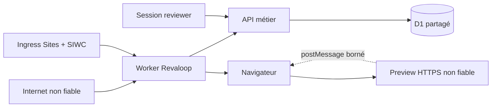
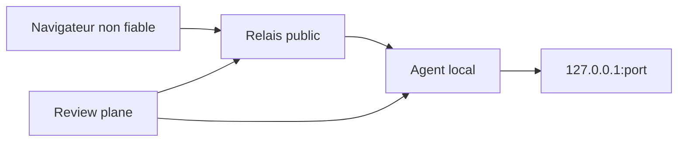

# Modèle de menace

- **Système :** Revaloop
- **Version :** 0.2
- **Dernière vérification :** 25 juillet 2026
- **Statut :** alpha pour pilote contrôlé, aucune donnée sensible

## Objectif

Ce document distingue les contrôles réellement implémentés des exigences du
futur tunnel. Il ne remplace ni revue de code, ni pentest, ni analyse juridique.

## Périmètre actuel

Inclus :

- landing et démo fictive ;
- dashboard développeur ;
- Sign in with ChatGPT fourni par Sites ;
- projets, releases, invitations, sessions, retours et décisions ;
- preview HTTPS tierce dans une iframe ;
- bridge facultatif `postMessage` ;
- API et D1 ;
- Worker et en-têtes.

Hors périmètre :

- proxy ou tunnel vers `localhost` ;
- agent et relais ;
- capture ou R2 ;
- preview construite dans un runner ;
- auto-hébergement qualifié ;
- données de production ou réglementées.

## Actifs

- identité et appartenance du développeur ;
- séparation entre organisations et projets ;
- secret d’invitation et token de session ;
- nom déclaratif du reviewer ;
- e-mail reviewer nullable pour clients API personnalisés, non collecté par
  l’interface fournie ;
- URL, commit et consignes de release ;
- contenu et contexte des retours ;
- bilan courant et approbation finale ;
- audit ;
- disponibilité et budget D1 ;
- confiance dans les limites affichées.

Le contenu, les cookies et la base de la preview sont des actifs de
l’application tierce. Revaloop ne doit pas les collecter.

## Acteurs

- visiteur anonyme ;
- développeur authentifié ;
- reviewer possédant une invitation ou session ;
- autre utilisateur SIWC dans son propre tenant ;
- attaquant Internet ;
- reviewer malveillant ;
- preview tierce compromise ;
- opérateur Sites/Cloudflare ;
- dépendance ou chaîne de build compromise ;
- futur agent ou relais compromis.

## Frontières



Hypothèses :

- Sites remplace/protège les headers d’identité réservés ;
- le build de production est servi en HTTPS ;
- D1 exécute un batch séquentiel de façon transactionnelle ;
- le développeur contrôle ou approuve l’URL de staging ;
- la cliente n’entre que des données fictives.

Un déploiement hors Sites doit remplacer la première hypothèse par un mécanisme
d’identité vérifiable.

## Invariants implémentés

### Développeur

- aucun fallback local en production ;
- identité obligatoire sur pages et API développeur ;
- provisionnement idempotent ;
- chaque ressource est résolue avec membre + organisation + projet ;
- un identifiant seul ne donne aucun droit ;
- suppression réservée au propriétaire.

### Invitation et session

- secret aléatoire de 32 octets ;
- uniquement son SHA-256 en D1 ;
- fragment absent du premier GET ;
- invitation one-shot ;
- échange session + consommation + audit atomique ;
- cookie opaque `Secure`, `HttpOnly`, `SameSite=Strict` ;
- durée maximale de 24 heures ;
- correspondance session/invitation/release vérifiée ;
- expiration et révocation vérifiées à la lecture et dans l’écriture finale ;
- fermeture de session côté serveur ;
- rotation révoquant les anciens accès ;
- nouvelle release interdite tant que la courante non expirée est
  `in_review` ou `changes_requested`.

### Autorisation métier

```text
développeur → membership → organisation → projet → release → ressource
reviewer → token hash → session → invitation → release → ressource
```

- transitions développeur et reviewer distinctes ;
- auteur reviewer issu de la session, avec nom déclaratif non authentifié ;
- séquence et insertion du retour dans le même batch ;
- une ligne de décision courante par release ;
- `changes_requested` non terminal et remplaçable par un bilan ultérieur ;
- approbation conditionnée à zéro retour ouvert dans le SQL d’insertion ;
- release approuvée ou remplacée non mutable ;
- checklist et retours encore actifs après une demande d’ajustements, bloqués
  seulement après approbation, remplacement ou expiration.

### Entrées et navigateur

- `Origin` exact sur toutes les mutations ;
- JSON et tailles bornés ;
- valeurs d’état/type/priority en listes fermées ;
- React encode les textes ;
- URL preview HTTPS, sans credentials, query ni localhost distant ;
- `event.origin` et `event.source` vérifiés pour le bridge ;
- bridge limité au pathname et titre, sans scroll ni ancre DOM ;
- CSP, `DENY`, `nosniff`, `no-referrer`, Permissions Policy ;
- routes privées non mises en cache et non indexables.

### Logs et audit

- aucun secret, cookie, corps de retour ou query sensible dans l’audit ;
- métadonnées en liste fermée ;
- audit conditionné à l’existence de la mutation ;
- hash tronqué pour les buckets de rate limit ;
- purge des buckets et audit ancien.

## Registre des risques actuels

| ID | Menace | Contrôle | Risque résiduel / action |
|---|---|---|---|
| T01 | header SIWC forgé | ingress Sites + fallback prod absent | documenter/tester l’ingress ; autre hébergeur interdit sans adaptateur |
| T02 | accès croisé tenant | joins membre/org/projet | ajouter tests intégration à deux identités |
| T03 | rejeu invitation | `used_at`, hash, batch atomique | bearer transférable avant premier usage |
| T04 | vol session | HttpOnly/Secure/Strict, 24 h, révocation | possession du navigateur suffit pendant la durée |
| T05 | CSRF | Strict + `Origin` | vérifier les futurs clients natifs séparément |
| T06 | écriture après révocation | garde dans SQL final | étendre les tests de concurrence D1 |
| T07 | approbation avec retour ouvert | transaction conditionnelle | maintenir tests de course |
| T08 | faux auteur | auteur dérivé de la session | nom d’invitation saisi par le développeur, possession du lien et identité réelle non vérifiées |
| T09 | fuite via URL preview | credentials/query refusés | hostname et path restent des métadonnées internes |
| T10 | preview malveillante | origine séparée, iframe sandbox, aucun secret exposé | `allow-same-origin` + scripts nécessaire à la preview ; surveiller |
| T11 | origine iframe trop large | src choisi par développeur, `frame-src https:` | instance fermée : allowlist recommandée |
| T12 | framing ou fonction embarquée refusés | aide temporisée + nouvel onglet | pas de détection fiable de XFO ; cookies tiers, OAuth, top-navigation, téléchargements et Permissions Policy peuvent casser un parcours |
| T13 | contenu externe mutable | libellé et commit déclaratif | aucune preuve d’immuabilité |
| T14 | annotation trompeuse | chemin/viewport filtrés + limite affichée | bridge ou non, aucun ancrage DOM/scroll ; position approximative |
| T15 | abus D1 | rate limits, tailles, purge | inscription SIWC libre et quotas globaux manquants |
| T16 | rétention excessive | expiration, purge, suppression projet | pas de suppression compte/org self-service |
| T17 | dépendance compromise | lockfile et revue | ajouter scans/provenance de release |
| T18 | Site globalement privé | protège tout | cliente externe bloquée |
| T19 | Site public | dashboard reste SIWC | inscription développeur libre, ajouter allowlist pour alpha fermée |
| T20 | décision prise pour un mauvais contenu | preview mutable | procès-verbal externe si enjeu contractuel |

T01, T02, T06, T07 et T19 demandent une validation d’intégration avant une
publication générale.

## Preview externe

La preview connaît l’adresse IP de la cliente et reçoit ses propres cookies
selon sa politique. Revaloop ne peut pas rendre privée une URL déjà publique.
L’invitation et le cookie reviewer protègent uniquement le plan de revue ; ils
ne sont jamais transmis à la preview et ne constituent pas son contrôle
d’accès.

Règles :

- staging dédié ;
- base et services sandbox ;
- aucune donnée réelle demandée ;
- origine distincte du portail ;
- pas de récupération serveur générique ;
- sandbox iframe ;
- `postMessage` à schéma fermé ;
- fallback nouvel onglet ;
- origine explicite dans `frame-ancestors` côté preview ;
- authentification et cookies cross-site testés sur les navigateurs cibles ;
- OAuth/SSO, popups, top-navigation et téléchargements testés ou basculés vers
  le nouvel onglet ;
- paiement, caméra, microphone et géolocalisation exclus du parcours embarqué
  par la `Permissions-Policy` actuelle ;
- aucune promesse d’immuabilité.

`allow-scripts` et `allow-same-origin` sont nécessaires pour une application
moderne. Comme la preview est cross-origin, elle ne peut pas lire le DOM ou les
cookies Revaloop. Ne jamais servir une preview non fiable sous l’origine
Revaloop. Le sandbox autorise aussi formulaires, modales et popups, mais pas
top-navigation ni téléchargement. Le bridge ne transmet que le chemin et le
titre ; il ne suit pas le scroll interne et n’ancre pas un retour à un élément.

## D1 et concurrence

Les invariants critiques utilisent des batches conditionnels. Un statement à
zéro changement n’est pas une erreur SQL ; c’est pourquoi :

- les inserts vérifient eux-mêmes le statut/session ;
- les updates dépendent de l’identifiant inséré ;
- les audits utilisent `INSERT ... SELECT WHERE EXISTS` ;
- l’application vérifie `meta.changes`.

La suite doit continuellement tester :

- deux échanges simultanés ;
- révocation pendant un retour ;
- retour pendant une approbation ;
- demandes d’ajustements successives puis approbation ;
- deux tenants avec identifiants connus.

## Futur data plane



| ID | Menace future | Porte d’entrée obligatoire |
|---|---|---|
| F01 | pivot réseau / SSRF | cible loopback exacte, aucune URL arbitraire |
| F02 | proxy ouvert | lease signé et hostname lié, pas de CONNECT générique |
| F03 | détournement | mTLS, clés courtes, rotation et révocation |
| F04 | confusion de tunnels | routage serveur et tests inter-projets |
| F05 | fuite de cookies/corps | logs sans contenu et divulgation du mode managé |
| F06 | faux E2EE | vocabulaire lié à la vraie terminaison TLS |
| F07 | DoS | limites, timeout, backpressure et quotas |
| F08 | Host/DNS rebinding | upstream fixé et host normalisé |
| F09 | vol credential CLI | stockage OS, device flow, scope minimal |
| F10 | binaire compromis | signature, checksum, provenance et update sûre |
| F11 | reprise de sous-domaine | alias jamais réattribué |
| F12 | accès après arrêt | lease révoqué et flux fermés |

## TLS

### Managé

TLS termine au relais. Le trafic est protégé sur le réseau, mais l’opérateur
peut lire le HTTP. Il ne faut jamais l’appeler chiffrement de bout en bout.

### Passthrough

TLS termine dans l’agent et le relais voit des octets opaques. Ce mode retire
auth edge, WAF, réécriture et injection du bridge. Certificats et compatibilité
navigateur restent en recherche.

## Preview hébergée future

Exécuter du code client exige runner rootless éphémère, filesystem jetable,
secrets minimaux, réseau sortant filtré, aucune route vers D1/control plane,
quotas CPU/mémoire/disque/temps et destruction vérifiée. Un conteneur partagé
seul n’est pas une garantie suffisante.

## Acceptation et maintenance

Un risque n’est accepté que si propriétaire, impact, durée, interface et date
de réévaluation sont documentés.

Mettre à jour ce modèle pour toute nouvelle route, mutation, identité,
preview, CSP, donnée, stockage, tunnel, terminaison TLS ou runner. Chaque risque
fermé doit pointer vers une preuve reproductible.
