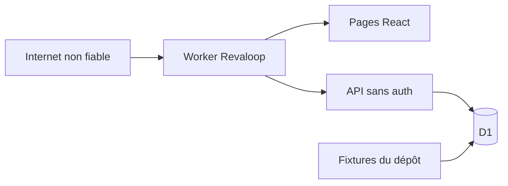
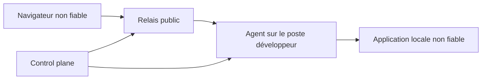

# Modèle de menace

- **Système :** Revaloop
- **Version du modèle :** 0.1
- **Dernière vérification :** 24 juillet 2026
- **Statut :** prototype non destiné à la production

## Objectif

Ce document décrit :

1. les menaces du prototype réellement présent dans le dépôt ;
2. les contrôles déjà en place ;
3. les conditions de sécurité nécessaires avant une utilisation réelle ;
4. les menaces du futur agent et relais, sans prétendre qu’elles sont déjà
   traitées.

Il ne remplace pas une revue de code, un test d’intrusion ou une analyse
juridique.

## Déclaration de sécurité actuelle

Le prototype n’offre **aucune confidentialité d’accès**. Le token de
démonstration est public, le dashboard n’est pas authentifié et les API de
mutation ne contrôlent pas l’autorisation. D1 ne contient que des fixtures et
des actions de démonstration.

Le prototype ne doit pas recevoir :

- donnée de production ;
- donnée personnelle réelle ;
- secret commercial ;
- cookie, clé ou mot de passe ;
- capture d’un projet client.

## Périmètre

### Inclus aujourd’hui

- landing ;
- dashboard développeur de démonstration ;
- espace client de démonstration ;
- Route Handlers `/api/workspace`, `/api/review/[token]` et
  `/api/feedback/[id]` ;
- repository et base D1 ;
- fixtures Maison Matisse ;
- Worker et en-têtes HTTP.

### Hors du système actuel

- application tierce réelle ;
- tunnel vers `localhost` ;
- agent local ;
- relais ;
- stockage R2 ;
- authentification ;
- comptes et organisations ;
- infrastructure auto-hébergée ;
- preview construite dans un runner.

Ces composants futurs sont néanmoins analysés plus bas pour fixer leurs
conditions d’entrée.

## Actifs à protéger

### Prototype

- intégrité des projets, releases, retours et décisions ;
- disponibilité de l’interface de démonstration ;
- base D1 et binding `DB` ;
- code source et chaîne de dépendances ;
- confiance des contributeurs dans les statuts documentaires ;
- absence de secrets ou de données réelles dans les fixtures et logs.

### Produit futur

- identité et compte du développeur ;
- secret d’invitation et session du reviewer ;
- contenu de la preview ;
- cookies, headers et corps transitant dans un tunnel ;
- captures, commentaires et pièces jointes ;
- code source, secrets et réseau du poste développeur ;
- certificats et clés de l’agent ;
- isolation entre projets, organisations, tunnels et runners ;
- traces d’audit et décisions contractuelles.

## Acteurs

- **visiteur anonyme** : consulte la landing ;
- **reviewer de démonstration** : utilise l’URL publique et soumet des actions ;
- **développeur de démonstration** : utilise le dashboard public ;
- **attaquant Internet** : envoie des requêtes arbitraires aux pages et API ;
- **reviewer malveillant** : possède un accès légitime futur mais tente de
  dépasser son projet ;
- **application preview malveillante** : contenu tiers cherchant à atteindre
  le portail ou ses secrets ;
- **opérateur compromis** : contrôle une partie du review ou data plane ;
- **co-tenant compromis** : cherche à accéder à un autre projet ;
- **dépendance compromise** : exécute du code lors du build ou au runtime.

## Frontières de confiance actuelles



La seule frontière de stockage est D1. Il n’existe pas de frontière entre
développeur, reviewer et attaquant : tous sont anonymes pour le serveur.

## Contrôles actuels

| Contrôle | Effet | Limite |
|---|---|---|
| CSP | restreint plusieurs sources et les ancêtres de frame | autorise encore scripts et styles inline |
| `nosniff` | réduit l’interprétation incorrecte de contenu | ne valide pas les entrées |
| `no-referrer` | évite la propagation du chemin dans le referrer | le token reste dans la requête et les logs d’accès |
| `X-Frame-Options: DENY` | empêche l’encapsulation de Revaloop | ne protège pas une future cible externe |
| `Permissions-Policy` | désactive plusieurs API navigateur | liste non exhaustive |
| robots `noindex` | réduit l’indexation volontaire | aucun contrôle d’accès |
| listes fermées d’état/type | rejette certaines valeurs invalides | pas d’autorisation |
| limites de longueur | réduit les entrées démesurées | pas de quota global |
| rendu React | encode le texte affiché | ne protège pas tous les futurs exports |
| requêtes D1 préparées | évite l’injection SQL sur ces requêtes | pas d’isolation métier |

## Risques actuels

Les niveaux sont qualitatifs pour prioriser le travail du prototype.

| ID | Menace | Impact | État actuel | Traitement requis |
|---|---|---|---|---|
| T01 | Lecture du projet par un tiers | élevé avec de vraies données | token public et fixe | invitation aléatoire, session et autorisation |
| T02 | Création de faux retours ou décisions | élevé | API anonyme | authentifier la session reviewer, vérifier la release |
| T03 | Modification arbitraire d’un retour | élevé | `PATCH` par identifiant seul | joindre identité, projet, release et retour |
| T04 | Réutilisation d’un token | élevé | aucune rotation ou révocation | token à usage contrôlé, session expirante |
| T05 | Token dans logs et historique | moyen | token dans le chemin | secret dans fragment puis échange ponctuel |
| T06 | Expiration contournée | moyen | champ non vérifié | appliquer l’heure serveur à chaque accès |
| T07 | CSRF ou requête cross-origin | moyen | pas de contrôle d’origine | cookie `SameSite`, vérification `Origin`, jeton CSRF si nécessaire |
| T08 | Brute force et abus d’écriture | moyen | pas de rate limit | quotas par IP, session et projet |
| T09 | Collision de numéro de retour | faible à moyen | calcul puis insertion séparés | transaction ou contrainte unique et retry |
| T10 | Perte ou accumulation de données | moyen | aucune suppression/rétention | politique, purge, export et suppression |
| T11 | Fuite entre tenants | critique dans un service réel | aucun modèle tenant | modèle d’autorisation et tests croisés |
| T12 | Faux sentiment de confidentialité | élevé | copie marketing plus forte que le code | bannière, matrice de statut et revue de contenu |
| T13 | Dépendance compromise | élevé | chaîne npm standard | lockfile, revue, scan et provenance de release |
| T14 | Déni de service D1 | moyen | pas de quota ni backpressure | limites de débit, coût et taille |

T01 à T08 et T11 bloquent toute utilisation avec un client réel.

Le rendu serveur de `/review/[token]` rejette désormais le token de
démonstration inconnu ou expiré avant d’afficher le projet. Cela évite la fuite
accidentelle des fixtures, sans transformer ce token public en authentification.
Une vraie version doit valider une session liée à une invitation secrète avant
de rendre toute donnée protégée.

## Invariants de sécurité du review plane cible

### Identité développeur

- l’identité provient d’un fournisseur explicitement configuré ;
- les headers d’identité sont supprimés à l’entrée puis réinjectés uniquement
  par un proxy de confiance ;
- aucun fallback de développement ne fonctionne en production ;
- chaque lecture ou mutation joint l’utilisateur à son projet.

### Invitation reviewer

- secret généré avec 32 octets aléatoires ;
- secret stocké uniquement sous forme de hash SHA-256 ;
- secret transporté dans le fragment d’une URL de jonction ;
- échange ponctuel par `POST` contre un cookie de session opaque ;
- fragment effacé par redirection avant la navigation ;
- cookie `Secure`, `HttpOnly`, `SameSite=Lax`, à durée limitée ;
- expiration et révocation vérifiées côté serveur ;
- PIN éventuel utilisé seulement comme second facteur avec rate limit.

Voir [ADR-0002](adr/0002-reviewer-authentication.md).

### Autorisation

Une ressource n’est jamais chargée uniquement par son identifiant. Les chaînes
de contrôle minimales sont :

```text
développeur → membership → projet → release → ressource
reviewer → session → invitation → room → release → ressource
```

Les tests doivent tenter un accès croisé pour chaque route.

### Contenu non fiable

- commentaires rendus comme texte par défaut ;
- Markdown éventuel assaini avec une liste fermée ;
- captures dans un bucket privé ;
- vérification du type réel, de la taille et des dimensions ;
- métadonnées d’image supprimées lorsque possible ;
- URL signée courte ou route média autorisée ;
- aucune donnée d’authentification du portail accessible à la preview.

### Journaux

Les logs ne contiennent pas :

- cookie ;
- token ;
- query string sensible ;
- corps de requête ;
- header d’autorisation ;
- contenu d’un commentaire ou d’une capture.

Les événements d’audit utilisent des identifiants internes et un ensemble de
métadonnées explicitement autorisé.

## Preview externe et isolation d’origine

Une URL externe future introduit une origine non fiable.

Menaces :

- script malveillant dans la preview ;
- tentative de vol de la session Revaloop ;
- framing interdit par CSP ou `X-Frame-Options` ;
- confusion entre URL déclarée et contenu réellement testé ;
- navigation hors des pages autorisées ;
- transmission du reviewer, de son IP ou de cookies à l’hébergeur tiers.

Règles :

- URL HTTPS sans credentials intégrés ;
- aucune récupération serveur générique de l’URL ;
- origine enregistrée de manière explicite ;
- portail et preview sur des origines séparées ;
- `postMessage` avec origine et schéma de message vérifiés ;
- fallback nouvel onglet plus capture si l’iframe est refusée ;
- libellé « URL externe non garantie immuable » ;
- aucune promesse que le contrôle d’accès Revaloop protège une URL déjà
  publique.

## Futur data plane

### Frontières



Le poste développeur et l’application locale ne sont pas supposés sûrs pour le
service. Le relais et le control plane ne sont pas supposés dignes de lire le
contenu dans un futur mode confidentiel.

### Menaces et portes d’entrée

| ID | Menace future | Exigence avant activation |
|---|---|---|
| F01 | agent transformé en pivot réseau/SSRF | cible loopback exacte par défaut, pas d’URL arbitraire |
| F02 | relais transformé en proxy ouvert | lease signé, hostname lié, aucune méthode `CONNECT` générique |
| F03 | détournement d’un tunnel | mTLS, clé courte durée, rotation et révocation |
| F04 | confusion entre deux tunnels | routage serveur vérifié et tests inter-projets |
| F05 | fuite de cookies/corps au relais | divulgation explicite en mode managé, logs sans contenu |
| F06 | prétendu chiffrement de bout en bout | vocabulaire lié au lieu réel de terminaison TLS |
| F07 | DoS par requête, corps ou WebSocket | limites, timeout, backpressure et quotas |
| F08 | Host header et DNS rebinding | upstream fixé, host normalisé, aucune résolution libre |
| F09 | vol de credentials CLI | stockage OS sûr, permissions minimales, device flow |
| F10 | binaire agent compromis | releases signées, checksums, provenance et mises à jour sûres |
| F11 | sous-domaine stable repris | alias jamais réattribué à un autre compte |
| F12 | accès persistant après arrêt | révocation du lease et fermeture effective des flux |

L’agent et le relais ne sont pas « sûrs par conception » tant que ces contrôles
ne sont pas implémentés et testés.

## TLS

### Mode managé

Le navigateur termine TLS au relais. Le trafic est chiffré sur le réseau, mais
le relais voit le HTTP en clair avant de le transmettre à l’agent.

Risques résiduels :

- opérateur ou relais compromis ;
- journalisation accidentelle de contenu ;
- accès légal ou administratif à l’infrastructure ;
- confusion marketing avec le chiffrement de bout en bout.

### Mode passthrough

Le relais ne voit que des octets TLS et la terminaison se produit dans l’agent.
Ce mode réduit la confiance accordée au relais mais retire :

- authentification HTTP à l’edge ;
- injection du widget ;
- inspection et WAF ;
- réécriture de headers ;
- observation applicative.

La distribution des certificats et la compatibilité navigateur ne sont pas
résolues. Le mode reste une recherche.

## Preview hébergée future

Une preview construite par Revaloop exécuterait du code non fiable. Elle exige
au minimum :

- runner éphémère rootless par build ;
- système de fichiers jetable ;
- secrets à portée minimale et non hérités ;
- réseau sortant filtré ;
- aucune route vers D1, le control plane ou les autres runners ;
- limites CPU, mémoire, disque et temps ;
- images épinglées et analysées ;
- destruction vérifiée après la durée prévue.

La simple exécution dans un conteneur partagé n’est pas une garantie
d’isolation suffisante.

## Acceptation du risque

Un risque ne peut être marqué « accepté » que si :

1. son propriétaire est identifié ;
2. l’impact et la durée sont documentés ;
3. l’interface ne donne pas une impression contraire ;
4. une date de réévaluation existe.

Le caractère « prototype » n’autorise pas l’emploi de données réelles.

## Maintenance

Mettre à jour ce document à chaque :

- nouvelle route ou mutation ;
- changement d’identité ou de session ;
- ajout de stockage ;
- ajout d’une preview externe ;
- changement de CSP ;
- modification du protocole agent/relais ;
- déplacement de la terminaison TLS ;
- ajout d’un runner ou d’un tenant.

Chaque risque fermé doit pointer vers des tests ou une preuve reproductible.
